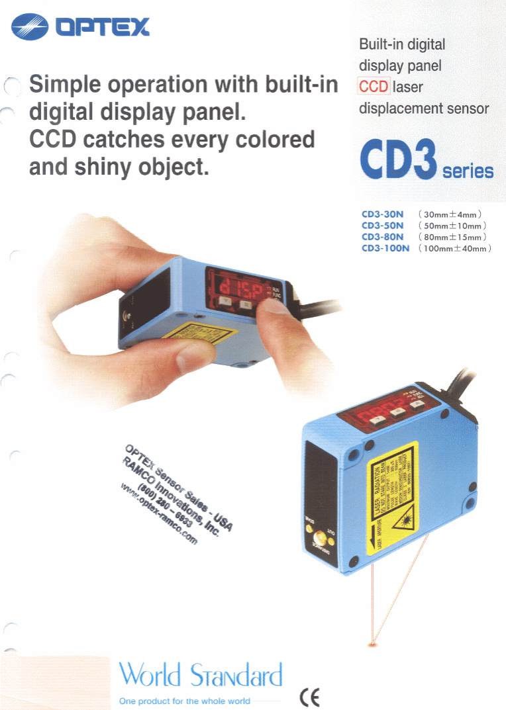
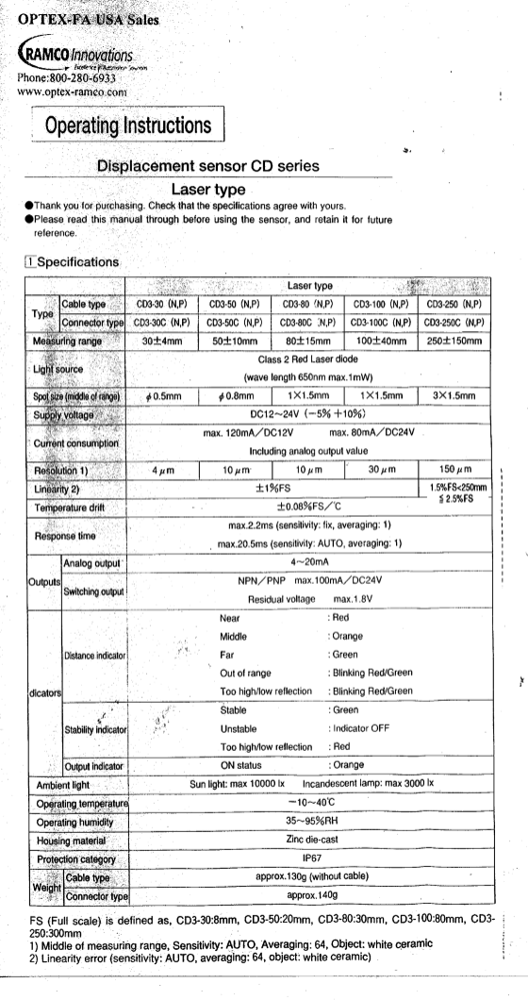
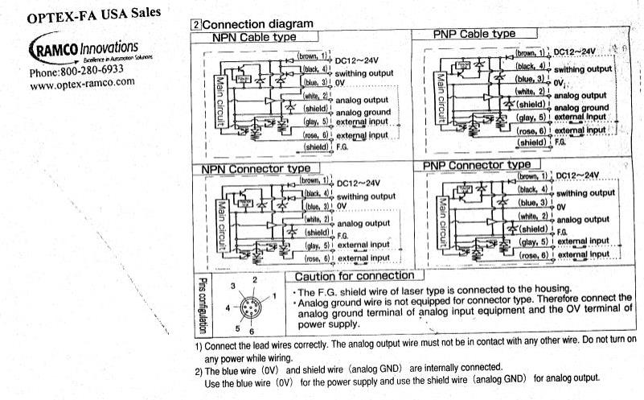
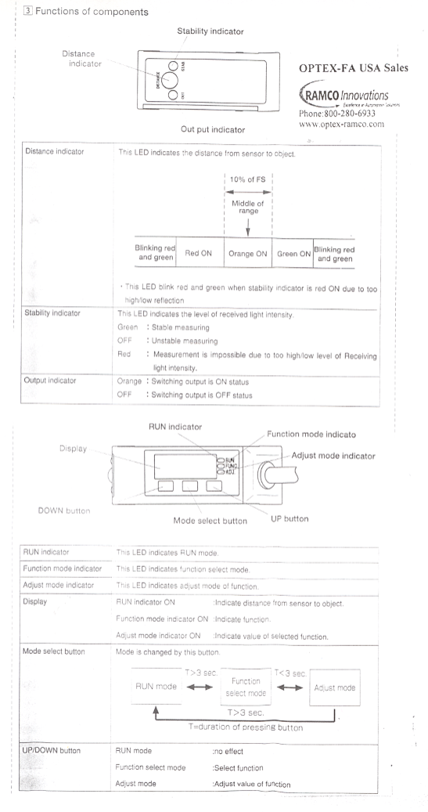

# Technical Documentation and Operating Guide: Optex FA CD3 Series (CD3S-30) Laser Displacement Sensor

This report compiles the complete technical documentation, wiring layouts, operating menus, and component descriptions for the **Optex FA CD3 Series Laser Displacement Sensor** (specifically model **CD3-30** with 30mm measurement range, commonly referred to as **CD3S-30**).

All diagrams and specifications have been extracted from the manufacturer's official catalogs and operating manuals.

---

## 1. Overview & Product Appearance
The Optex FA CD3 Series is a compact, high-precision laser displacement sensor featuring a built-in digital display panel and built-in amplifier, eliminating the need for external controllers. It utilizes a CCD receiver to achieve stable measurements on various colors and shiny/reflective materials.

### Key Features
* **Built-in Digital Display Panel:** Clear red LED display showing real-time distance and parameter values.
* **Built-in Amplifier:** Compact design with IP67 protective housing.
* **CCD Receiver Technology:** Reliable displacement sensing even on black rubbers, ceramics, and shiny-surface materials (conventional PSD sensors struggle with color/surface changes).

---

## 2. Technical Specifications
Below is the official specifications table from the Optex FA operating instructions. It compares the **CD3-30** (30mm range) with other models in the CD3 series:

### Key Specifications (CD3-30 / CD3-30C)
* **Measurement Center Distance:** 30 mm
* **Measuring Range:** 30 ± 4 mm (26 mm to 34 mm)
* **Light Source:** Class 2 Red Laser Diode (wavelength 650 nm, max output 1 mW)
* **Spot Size (Middle of Range):** $\varnothing$ 0.5 mm
* **Supply Voltage:** 12 to 24 VDC (-5% to +10%)
* **Current Consumption:** Max. 120 mA at 12 VDC / Max. 80 mA at 24 VDC
* **Resolution:** 4 $\mu$m (at center of range, Sensitivity: AUTO, Averaging: 64, Object: white ceramic)
* **Linearity:** $\pm$ 1% F.S. (Full Scale = 8 mm)
* **Response Time:** Max. 2.2 ms (Sensitivity: Fix, Averaging: 1) / Max. 20.5 ms (Sensitivity: AUTO, Averaging: 1)
* **Housing Material:** Zinc die-cast
* **Protection Class:** IP67 waterproof/dustproof
* **Weight:** Approx. 130g (Cable type without cable) / Approx. 140g (Connector type)

---

## 3. Wiring and Connection Diagrams
The CD3 Series is available in both **Cable Type** (pre-wired multi-core cable) and **Connector Type** (M12 6-pin connector). Both types have NPN and PNP output configurations:

### Wire Color and Pinout Mappings
* **Brown (Pin 1):** DC 12 to 24 V Power Supply
* **Blue (Pin 3):** 0 V / Ground (GND)
* **Black (Pin 4):** Switching / Control Output (NPN or PNP open collector, max. 100mA / 24VDC)
* **White (Pin 2):** Analog Output (4 to 20 mA analog signal)
* **Gray (Pin 5):** External/Remote Input (MF / Laser-Off / Hold)
* **Rose/Pink (Pin 6):** External/Remote Input (Teaching / Reset)
* **Shield:** Analog Ground (GND) and Frame Ground (F.G.)

### Crucial Installation Warnings
1. **Separation of Grounds:** The blue wire (0V) and shield wire (analog GND) are internally connected. Use the blue wire (0V) for the power supply, and use the shield wire (analog GND) for the analog output device connection.
2. **Connector Type Grounding:** The analog ground wire is not present in the connector type. Therefore, you must connect the analog ground terminal of your analog input equipment (e.g., DAQ card, PLC) directly to the 0V terminal of the power supply.
3. **No-Power Wiring:** Ensure all power is turned off before executing any wiring. Do not allow the analog output wire (White) to touch any other conductor to prevent short circuits.

---

## 4. Operation and Display Menu
The user interface on the sensor consists of a 4-digit LED display, status indicators, and three programming buttons:

### Display and Indicators
* **Distance Indicator (DISTANCE):**
  * **Blinking Red and Green:** Out of range or reflection is too low/high.
  * **Red ON:** Target is too close (Near).
  * **Orange ON:** Target is at the center of the measuring range ($\pm$ 10% of Full Scale).
  * **Green ON:** Target is far (Far).
* **Stability Indicator (STAB):**
  * **Green ON:** Measurement is stable.
  * **OFF:** Measurement is unstable.
  * **Red ON:** Measurement is impossible (reflection is too high or too low).
* **Output Indicator (OUT):**
  * **Orange ON:** Switching output is in the ON state.
  * **OFF:** Switching output is in the OFF state.

### Operation Menu & Button Controls
The sensor is programmed using three buttons: **DOWN**, **Mode Select (Center)**, and **UP**.

* **Mode Selection:**
  * **RUN Mode $\leftrightarrow$ Function Select Mode:** Press and hold the **Center (Mode Select)** button for **longer than 3 seconds**.
  * **Function Select Mode $\leftrightarrow$ Adjust Mode:** Press the **Center (Mode Select)** button briefly (**less than 3 seconds**).
  * **Adjust Mode $\leftrightarrow$ RUN Mode:** Press and hold the **Center (Mode Select)** button for **longer than 3 seconds** to save settings and return.
* **Adjusting Values:** Use the **UP** and **DOWN** buttons inside **Function Select** or **Adjust** modes to scroll through options and change parameter values.

### Specialized Functions
* **Offset Function (Zero Adjustment):** Allows resetting the current measurement to zero. This is useful for baseline calibration.
* **Scaling Adjustment:** Corrects the relation between physical displacement and the analog 4-20mA current output (adjustable in a range of $\pm$ 50% from the default scale).
* **Control Output Pre-Setting (Teaching):** Teach the sensor top and bottom limits using actual workpieces.
* **Memory Patterns:** Allows storing up to 3 separate detection programs.
