# EXPERIMENTAL MEASUREMENT REPORT: GEAR DRIVE SYSTEM

**Table of Contents**

- [PART 1: DRIVE SYSTEM](#part-1-drive-system)
- [PART 2: MEASUREMENT SYSTEM](#part-2-measurement-system)
- [PART 3: LABVIEW PROGRAMMING](#part-3-labview-programming)
- [PART 4: RESULTS, LIMITATIONS, AND FUTURE WORK](#part-4-results-limitations-and-future-work)
- [APPENDIX A: LABVIEW PROGRAM SCREENSHOTS](#appendix-a-labview-program-screenshots)
- [APPENDIX B: EQUIPMENT DATASHEETS AND REFERENCES](#appendix-b-equipment-datasheets-and-references)

**Figure Index**

| Figure | Description |
|:---|:---|
| 1 | Test rig overview |
| 2 | Electric motor GR-5IK90A-S |
| 3 | Variable frequency drive (YASKAWA V1000) |
| 4 | Control box – front panel (inverter, torquemeter, speedmeter) |
| 5 | Control box – rear panel (motor connector, NFB, power input) |
| 6 | Control box – internal wiring |
| 7 | Belt drive – synchronous belt and pulleys |
| 8 | Gearbox – 2-stage reduction gearbox |
| 9 | Gear test sets overview |
| 10 | Rolling bearing – NACHI 6201ZE |
| 11 | Bearing close-up |
| 12 | Magnetic powder brake |
| 13 | Ji-Xiang DBK-1024V brake controller board |
| 14 | PCB Piezotronics 356A32/NC accelerometer |
| 15 | Accelerometer wiring |
| 16 | Optical incremental encoder – operating principle (A/B/Z signals) |
| 17 | Eddy-current proximity probe – operating principle |
| 18 | Proximity probe – dimensional drawing (Bently Nevada) |
| 19 | Proximity sensor installed on test rig |
| 20 | RK4 Proximitor Assembly – front (PROX OUT connectors) |
| 21 | RK4 Proximitor Assembly – rear (probe connections, power) |
| 22 | RK4 Motor Speed Controller – rear panel |
| 23 | Torque sensor RT-2.5 Nm |
| 24 | Strain gauge – Wheatstone bridge detail |
| 25 | Torque amplifier JS-100 |
| 26 | NI USB-9234 module |
| 27 | NI USB-9234 channel wiring diagram |
| 28 | NI USB-6210 module |
| 29 | NI USB-6210 pinout |
| 30 | LabVIEW VI Front Panel |
| 31 | NI DAQmx example: Read Encoder (Continuously Clock) |
| 32 | Producer–Consumer architecture pattern (NI documentation) |
| 33 | Flat Sequence structure — software synchronization of two DAQmx tasks |
| **A1** | *(Appendix)* LabVIEW Block Diagram 1 – Task initialization frame |
| **A2** | *(Appendix)* LabVIEW Block Diagram 2 – Acquisition execution frame (Producer + Consumer loops) |
| **A3** | *(Appendix)* LabVIEW Block Diagram 3 – Consumer loop detail (TDMS write) |


> **Experiment Objective:**
> To simultaneously collect multi-channel data from multiple sensor types (acceleration, proximity, torque, speed) for the diagnosis and condition monitoring of gear faults under various operating conditions (speed, load, fault type, gear material).

This report describes the hardware configuration, sensor selection, data acquisition architecture, and LabVIEW software design used to build a gear fault diagnosis test rig. The rig is designed to generate a controlled, repeatable dataset covering multiple fault modes (tooth root crack, chipped tooth, missing tooth) across multiple operating conditions (5 speed levels × multiple load levels × 4 gear material/fault-type combinations). The collected multi-channel dataset is intended for use in developing and benchmarking signal processing and machine learning algorithms for gear condition monitoring.

<p align="center">
  
  <br><em>Figure 1 – Test rig overview</em>
</p>

---

## PART 1: DRIVE SYSTEM

The drive system of the test rig is designed around a unidirectional power flow: from the prime mover (AC motor + VFD) through a synchronous belt drive to a 2-stage spur gearbox, with a magnetic powder brake as the controllable load at the output. This configuration allows independent control of both the input rotational speed (via the VFD) and the output resistive torque (via the brake), creating a well-defined operating point for each measurement session.

---

### 1.1. Prime Mover

#### a. Electric Motor — GIN RE ELECTRIC MOTOR GR-5IK90A-S

<p align="center">
  
  <br><em>Figure 2 – Electric motor GR-5IK90A-S</em>
</p>

| Parameter | Value |
|:---|:---|
| Manufacturer | GIN RE ELECTRIC MOTOR |
| Model | GR-5IK90A-S |
| Rated Power | 90 W |
| Rated Current | 0.55 A |
| Rated Torque | 5.5 kg·cm (≈ 0.54 N·m) |
| Voltage | 220 V / 3-phase |
| Number of Pole Pairs ($p$) | 2 pole pairs (4 poles) |
| Maximum Speed | 1750 rpm |

**Operating Principle — 3-Phase Induction Motor:**

The GR-5IK90A-S is a 3-phase squirrel-cage induction motor. Its operating principle is based on electromagnetic induction: when 3-phase AC current flows through the stator windings (which are spatially offset by 120°), a rotating magnetic field is produced at the synchronous speed $n_s$. The rotor conductors, cutting through this rotating field, have electromotive forces (EMF) induced in them, which drive rotor currents. The interaction between the rotor currents and the stator field produces a mechanical torque that accelerates the rotor in the direction of the rotating field.

The synchronous speed of the rotating magnetic field depends on the supply frequency $f$ and the number of pole pairs $p$:

$$n_s = \frac{60 \times f}{p}$$

Since the GR-5IK90A-S has $p = 2$ pole pairs (4 poles total), the synchronous speed at the standard inverter-controlled frequencies used in this experiment are:

| Inverter Frequency ($f$) | Synchronous Speed ($n_s$) |
|:---:|:---:|
| 10 Hz | 300 rpm |
| 20 Hz | 600 rpm |
| 30 Hz | 900 rpm |
| 40 Hz | 1200 rpm |
| 50 Hz | 1500 rpm |


> [!NOTE]
> Because the actual rotor speed is affected by both VFD frequency setting and load conditions, the actual shaft speed **must be measured directly** using the optical encoder mounted on the motor shaft rather than estimated from the inverter frequency alone. This is essential for accurate signal analysis, particularly for computing gear mesh frequencies and bearing fault frequencies from the measured data.

---

#### b. Variable Frequency Drive — YASKAWA V1000 (CIMR-VU Series)

<p align="center">
  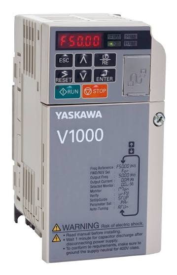
  <br><em>Figure 3 – Variable frequency drive (YASKAWA V1000)</em>
</p>

The YASKAWA V1000 is a compact, general-purpose AC inverter (VFD — Variable Frequency Drive) that enables stepless speed control of the induction motor by varying both the output frequency and voltage. Using a VFD rather than a fixed-speed motor allows the experiment to be conducted at multiple, precisely repeatable speed levels without physically changing any mechanical components.

**Key Technical Specifications:**

| Parameter | Value |
|:---|:---|
| Manufacturer | Yaskawa Electric Corporation |
| Product Line | V1000 / CIMR-VU Series (CIMR-VUBA — Single-Phase 200V) |
| Input Voltage | Single-phase 200–240 VAC (+10%, -15%), 50/60 Hz (±5%) |
| Output Voltage | 3-phase 200–240 VAC (proportional to input voltage) |
| Output Frequency Range | 0.01 – 400 Hz |
| Control Method | Open-Loop Current Vector (OLV); V/f; PM OLV |
| Overload Capacity | Heavy Duty: **150%** for 60 s; Normal Duty: **120%** for 60 s |
| Communication | Built-in RS-485 (Memobus/Modbus RTU, up to 115.2 kbps); optional: PROFIBUS-DP, EtherCAT, EtherNet/IP, PROFINET, CANopen |
| Protection Class | IP20 (open chassis); optional NEMA Type 1 |
| Operating Temperature | -10°C to +50°C |

**V/f Control vs. Open-Loop Vector Control:**

The V1000 supports two primary control modes relevant to this experiment:

- **V/f Control:** Maintains a constant voltage-to-frequency ratio (V/f) as the output frequency is changed. This is the simplest method and is adequate for applications where speed precision is not critical. Torque performance at low speeds is limited.
- **Open-Loop Current Vector (OLV) Control:** Uses a mathematical model of the motor to estimate the rotor flux angle and independently control the magnetizing current component and the torque-producing current component. This provides better torque response and more precise speed regulation than V/f control, without requiring a shaft encoder.

For this experiment, since precise speed control accuracy is not critical (the actual speed is measured by the encoder), V/f mode is sufficient and is the default operating mode.

**Control Box and Panel Description:**

The V1000 inverter is housed inside a dedicated **control box** (YueXu BV-90) together with a Ji-Xiang brake controller, DC power supplies, and two digital process controllers (Torquemeter and Speedmeter displays).

<p align="center">
  
  <br><em>Figure 4 – Control box front panel: (left) YASKAWA V1000 inverter; (center) Torquemeter display; (right) Speedmeter display; (bottom center) Current knob and Brake Exciting terminals</em>
</p>

<p align="center">
  
  <br><em>Figure 5 – Control box rear panel: (A) Motor output connector (3-phase); (B) Command &amp; Feedback port (DB-15); (C) NFB circuit breaker; (D) Fuse; (E) 220V power input</em>
</p>

<p align="center">
  
  <br><em>Figure 6 – Control box internal wiring: (top-left) NFB breaker; (top-right) cooling fan; (center) Mean Well power supply; (right) Ji-Xiang DBK-1024V brake controller board; (bottom) torque signal conditioning modules</em>
</p>

**Control Panel and Power-Up Procedure:**

The V1000 inverter is operated as follows:

1. **Power ON:** Push the NFB (No-Fuse Breaker, panel **C**) on the control box rear panel to the ON position to supply 220V to the system.
2. **Set Frequency:** Press the `LO/RE` key on the V1000 front panel to switch to Local control mode. Use the `▲` / `▼` arrow keys to adjust the frequency. Press `ENTER` to save.
3. **Start Motor:** Press the `RUN` key — the indicator light will illuminate and the motor will start at the set frequency.
4. **Stop Motor:** Press the `STOP` key.

Preset frequencies used in this experiment: **10 Hz, 20 Hz, 30 Hz, 40 Hz, 50 Hz**.

---

### 1.2. Drive Train

#### a. Motor-to-Gearbox Coupling — Synchronous Belt Drive

<p align="center">
  
  <br><em>Figure 7 – Synchronous belt drive (timing belt and pulleys)</em>
</p>

A synchronous (timing) belt drive is used to transmit power from the motor shaft to the gearbox input shaft. The use of a synchronous belt — rather than a V-belt or flat belt — is a deliberate design choice: synchronous belts rely on positive tooth engagement (like a chain) rather than friction, which eliminates slip entirely and ensures a fixed, repeatable speed ratio at all times. This is essential for accurate signal analysis, where the timing relationship between the motor and gearbox must be precisely known.

**Belt:**

| Parameter | Value |
|:---|:---|
| Manufacturer / Part No. | Gates PowerGrip **339-GT3** |
| Belt Type | Synchronous (Timing) Belt |
| Material | Synthetic rubber (EPDM or Neoprene) with fiberglass tension cords |
| Belt Circumference | 339 mm |
| Tooth Pitch | 3 mm (GT3 = Gates Tooth 3mm pitch) |
| Number of Teeth | 113 |
| Belt Width | 6.4 mm |

**Pulleys:**

| Parameter | Value |
|:---|:---|
| Number of Teeth | 34T (same for both driving and driven pulleys — belt ratio 1:1) |
| Tip Diameter | ≈ 31.68 mm |
| Tooth Width | 7.04 mm |
| Material | Unknown (likely steel or aluminum) |
| Tooth Profile | Rounded (GT3 profile) |

> [!NOTE]
> Since both pulleys have the same number of teeth (34T), the belt drive ratio is **1:1** — meaning the gearbox input shaft speed is exactly equal to the motor shaft output speed. The belt drive introduces no additional speed reduction or step-up.

The belt mesh frequency (BMF) — the frequency at which individual belt teeth engage the pulley teeth — is:

$$f_{BMF} = Z_{pulley} \times f_{motor} = 34 \times f_{motor}$$

At 50 Hz motor frequency ($f_{motor} = 25$ Hz): $f_{BMF} = 34 \times 25 = 850$ Hz. This harmonic may appear in the vibration spectrum and should be distinguished from gear-related harmonics during signal analysis.

---

#### b. Gear Drive System — 2-Stage Reduction Gearbox

<p align="center">
  
  <br><em>Figure 8 – 2‑stage reduction gearbox</em>
</p>

**Drive Configuration:**

The gearbox uses a **2-stage series reduction** layout with 3 parallel shafts and 4 spur gears. Power flows from the input shaft through two sequential meshing stages to the output shaft:


<p align="center">
  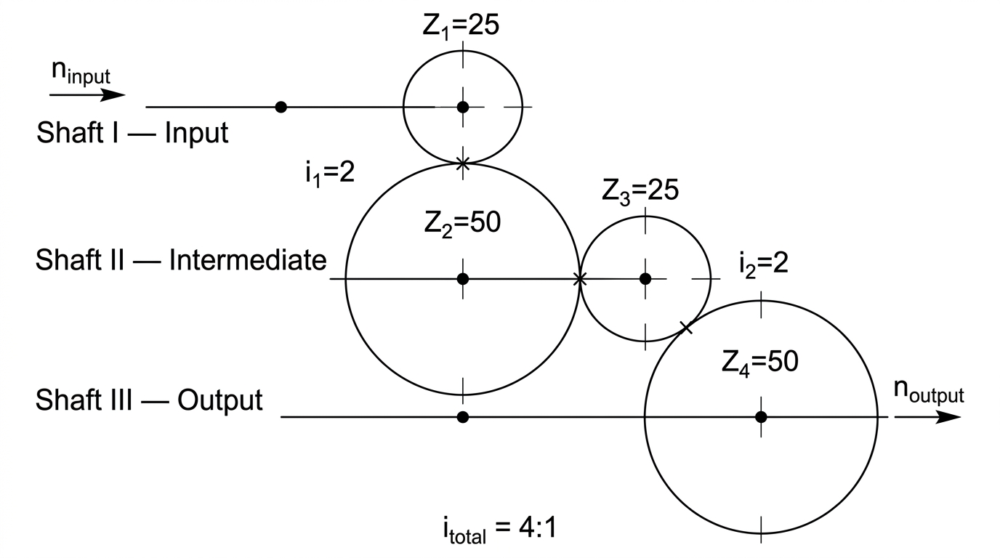
  <br><em>Figure – Kinematic diagram of the 2-stage spur gear reducer (sơ đồ động học hộp giảm tốc 2 cấp bánh răng trụ). Gears are represented by pitch circles per ISO kinematic convention. Mesh points marked with ×. i₁ = i₂ = 2, i<sub>total</sub> = 4:1.</em>
</p>


**Overall Gear Ratio:**

$$i_{total} = i_1 \times i_2 = \frac{Z_2}{Z_1} \times \frac{Z_4}{Z_3} = \frac{50}{25} \times \frac{50}{25} = 2 \times 2 = \mathbf{4:1}$$

The 4:1 reduction means the output shaft rotates at one-quarter the input shaft speed while delivering (theoretically) four times the torque. This is a common strategy in gear-driven machinery — the 90 W motor with a rated torque of only 0.54 N·m is amplified to approximately 2.16 N·m at the output shaft (before friction and windage losses), which is within the 2.5 N·m measurement range of the torque sensor.

Shaft speeds at each operating frequency:

| $f_{inv}$ | $f_{motor}$ | $n_{motor}$ (approx.) | $n_{intermediate}$ | $n_{output}$ |
|:---:|:---:|:---:|:---:|:---:|
| 10 Hz | 5 Hz | ~300 rpm | ~150 rpm | ~75 rpm |
| 20 Hz | 10 Hz | ~600 rpm | ~300 rpm | ~150 rpm |
| 30 Hz | 15 Hz | ~900 rpm | ~450 rpm | ~225 rpm |
| 40 Hz | 20 Hz | ~1200 rpm | ~600 rpm | ~300 rpm |
| 50 Hz | 25 Hz | ~1500 rpm | ~750 rpm | ~375 rpm |

**Gear Specifications:**

| Parameter | Small Gears (Z₁, Z₃) | Large Gears (Z₂, Z₄) |
|:---|:---:|:---:|
| Type | Spur Gear | Spur Gear |
| Number of Teeth ($Z$) | 25 | 50 |
| Module ($m$) | 2 | 2 |
| Pressure Angle ($\alpha$) | 20° | 20° |
| Tip Diameter ($D_a$) | 54 mm | 104 mm |
| Reference Diameter ($D$) | $m \times Z = 50$ mm | $m \times Z = 100$ mm |

**Gear Mesh Frequency (GMF):**

The Gear Mesh Frequency is the rate at which individual gear teeth engage (mesh) each other. It is the most fundamental frequency in gearbox vibration analysis:

$$f_{GMF} = Z \times f_{shaft} \quad \text{(Hz)}$$

where $f_{shaft}$ is the rotational frequency of the gear in Hz ($f_{shaft} = n/60$).

For Stage 1 (input shaft driving Z₁ = 25):

$$f_{GMF1} = Z_1 \times f_{shaft,in} = 25 \times f_{motor}$$

For Stage 2 (intermediate shaft driving Z₃ = 25):

$$f_{GMF2} = Z_3 \times f_{shaft,intermediate} = 25 \times \frac{f_{motor}}{2}$$

Note that since $Z_1 = Z_3 = 25$: $f_{GMF2} = \frac{1}{2} f_{GMF1}$.

Both stages share the same GMF harmonic families. Computed GMF values at each inverter frequency:

| $f_{inv}$ | $f_{motor}$ (Hz) | $f_{GMF1}$ (Hz) | $f_{GMF2}$ (Hz) |
|:---:|:---:|:---:|:---:|
| 10 Hz | 5.0 | 125.0 | 62.5 |
| 20 Hz | 10.0 | 250.0 | 125.0 |
| 30 Hz | 15.0 | 375.0 | 187.5 |
| 40 Hz | 20.0 | 500.0 | 250.0 |
| 50 Hz | 25.0 | 625.0 | 312.5 |

> [!NOTE]
> In a healthy gearbox, prominent peaks at GMF and its harmonics (2×GMF, 3×GMF, ...) are expected and normal. Fault detection relies on identifying **sidebands** around these peaks — spectral components spaced at the rotational frequency of the defective gear ($\pm k f_{shaft}$, $k = 1, 2, 3, ...$). The appearance of sidebands, particularly with asymmetric amplitude distribution, is a key indicator of gear tooth damage.

---

**Available Gear Test Sets:**

<p align="center">
  
  <br><em>Figure 9 – Gear test sets overview</em>
</p>

The experiment uses four interchangeable gear sets to study the effect of fault type, fault severity, and gear material on the vibration signature:

| Set | Description | Material | Surface Treatment |
|:---:|:---|:---|:---|
| **Set 1** | 2 pairs — 4 gears. **All gears are healthy (currently mounted on the shaft).** | Steel S45C | Electroless nickel plating |
| **Set 2** | 3 small gears (25T) with **tooth root crack** faults at 3 different severity levels | Steel S45C | None |
| **Set 3** | 3 small gears (25T) with **tooth root crack** faults at 3 different severity levels | Aluminum (Al) | None |
| **Set 4** | 2 pairs — 4 gears: 2 large gears (50T) healthy; 1 small gear with **chipped tooth**, 1 small gear with **missing tooth** | Unknown | Unknown |

**Vibration Signatures of Each Fault Type:**

Understanding the expected vibration signature of each fault type is essential for designing the signal processing pipeline and validating the measurement system:

- **Tooth Root Crack:** A surface or sub-surface crack at the tooth root creates a local reduction in tooth stiffness. As the cracked tooth enters and exits mesh, a periodic modulation of the vibration amplitude is produced at the rotational frequency of the affected gear. In the frequency domain, this appears as sidebands spaced at $f_{shaft}$ around the GMF and its harmonics. The sideband amplitude grows with crack severity. Early-stage cracks may also excite the gear's structural natural frequency, producing impulsive ring-down signatures in the time waveform.

- **Chipped Tooth:** Partial loss of tooth material from the tip or flank region causes an amplitude and phase modulation of the meshing signal each time the damaged tooth passes through the mesh zone. This produces sidebands similar to the crack case, often accompanied by impulsive transient events in the time domain. Envelope analysis of the high-frequency resonance excited by each impact is effective for detecting chipped teeth at early stages.

- **Missing Tooth:** Complete loss of one tooth causes a severe impact event once per revolution of the affected gear, corresponding to the moment when the adjacent teeth experience the sudden change in load distribution. This creates a strong impulse in the time domain at $f_{shaft}$ repetition rate, which in the frequency spectrum manifests as a family of harmonics at $f_{shaft}$ and its multiples, plus significant modulation sidebands around the GMF.

---

**Rolling Bearings — NACHI 6201ZE:**

<p align="center">
  
  <br><em>Figure 10 – Rolling bearing NACHI 6201ZE</em>
</p>

<p align="center">
  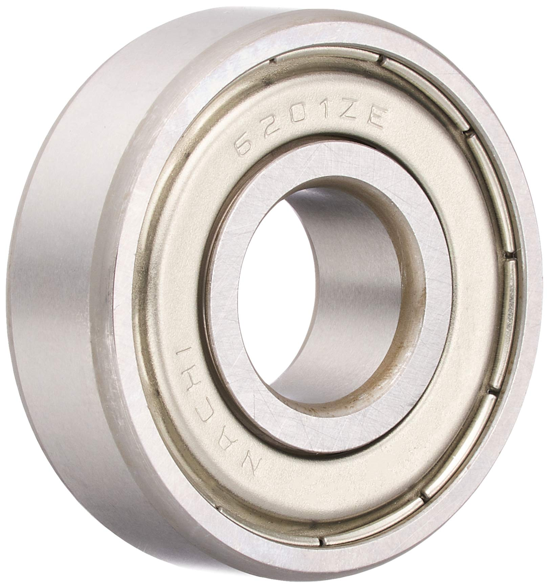
  <br><em>Figure 11 – Bearing close‑up showing shield and outer race</em>
</p>

Rolling element bearings are used to support the three gearbox shafts. The NACHI 6201ZE is a single-row deep groove ball bearing selected for its compact size (12 mm bore suitable for small laboratory-scale shafts) and high-speed capability.

| Parameter | Value |
|:---|:---|
| Model | NACHI 6201ZE |
| Type | Single-Row Deep Groove Ball Bearing |
| Bore Diameter ($d$) | 12 mm |
| Outer Diameter ($D$) | 32 mm |
| Width ($B$) | 10 mm |
| Mass | ≈ 0.037 kg |
| Dynamic Load Rating ($C_r$) | 6,800 N |
| Static Load Rating ($C_{or}$) | 3,050 N |
| Max Speed (grease lubrication) | 22,000 rpm |
| Max Speed (oil lubrication) | 28,000 rpm |

**Bearing Internal Geometry (6201 standard dimensions):**

| Parameter | Value |
|:---|:---|
| Number of Rolling Elements ($N_b$) | 8 balls |
| Pitch Diameter ($P_d$) | 22 mm |
| Ball Diameter ($B_d$) | 5.953 mm |
| Contact Angle ($\phi$) | 0° (radial deep groove bearing) |

**Bearing Fault Characteristic Frequencies:**

When a defect (spall, pit, crack) exists on a specific bearing component, periodic impact forces are generated each time a rolling element passes over the defect. Each defect location produces a characteristic repetition frequency that can be calculated from the bearing geometry and shaft speed $f_r$ (Hz):

| Frequency | Formula | Multiplier of $f_r$ |
|:---|:---|:---:|
| **BPFO** — Ball Pass Frequency Outer Race | $\frac{N_b}{2} f_r \left(1 - \frac{B_d}{P_d}\cos\phi\right)$ | **2.918** |
| **BPFI** — Ball Pass Frequency Inner Race | $\frac{N_b}{2} f_r \left(1 + \frac{B_d}{P_d}\cos\phi\right)$ | **5.082** |
| **BSF** — Ball Spin Frequency | $\frac{P_d}{2B_d} f_r \left[1 - \left(\frac{B_d}{P_d}\cos\phi\right)^2\right]$ | **1.712** |
| **FTF** — Fundamental Train Frequency | $\frac{f_r}{2}\left(1 - \frac{B_d}{P_d}\cos\phi\right)$ | **0.3647** |

Using the 6201 geometry ($N_b = 8$, $P_d = 22$ mm, $B_d = 5.953$ mm, $\phi = 0°$, $B_d/P_d = 0.2706$):

Computed bearing fault frequencies at each shaft speed:

| Shaft | $f_{inv}$ | $f_r$ (Hz) | BPFO (Hz) | BPFI (Hz) | BSF (Hz) | FTF (Hz) |
|:---|:---:|:---:|:---:|:---:|:---:|:---:|
| Input (Shaft 1) | 10 Hz | 5.00 | 14.59 | 25.41 | 8.56 | 1.82 |
| Input (Shaft 1) | 20 Hz | 10.00 | 29.18 | 50.82 | 17.12 | 3.65 |
| Input (Shaft 1) | 30 Hz | 15.00 | 43.77 | 76.23 | 25.68 | 5.47 |
| Input (Shaft 1) | 40 Hz | 20.00 | 58.36 | 101.64 | 34.24 | 7.29 |
| Input (Shaft 1) | 50 Hz | 25.00 | 72.95 | 127.05 | 42.80 | 9.12 |
| Intermediate (Shaft 2) | 50 Hz | 12.50 | 36.47 | 63.53 | 21.40 | 4.56 |
| Output (Shaft 3) | 50 Hz | 6.25 | 18.24 | 31.76 | 10.70 | 2.28 |

> [!NOTE]
> These frequencies are calculated assuming the outer race is stationary and the inner race rotates with the shaft. Since the bearings in this rig are standard fixed-outer-race configuration, these values are directly applicable. The BPFO and BPFI values should be the primary targets in the vibration spectrum during post-processing if bearing fault detection is part of the analysis objective. Note that bearing fault signatures typically manifest as modulated sidebands rather than clean spectral lines due to random slip in the rolling elements.

**Bearing Housing:** Material is not confirmed; likely gray cast iron FC200 per common industrial practice. Exact dimensions to be reported upon measurement of the physical housing. The stiffness and damping properties of the housing affect the transmission path between the fault source and the mounted accelerometer.

**Jaw Coupling:** Flexible jaw couplings are used at each shaft connection point (motor-to-belt drive input, gearbox output-to-torque sensor, torque sensor-to-brake). Jaw couplings accommodate minor angular and parallel misalignment (typically ±1°) and dampen torsional shock loads, protecting the torque sensor from impact overloads during gearbox transients.

---

#### c. Output Load — Magnetic Powder Brake

<p align="center">
  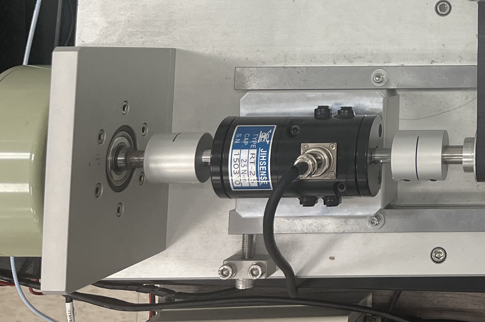
  <br><em>Figure 12 – Magnetic powder brake</em>
</p>

The magnetic powder brake provides a controlled, adjustable resistive torque at the gearbox output shaft, simulating the load that would be imposed by a driven machine in a real application. The ability to vary the load independently of speed is essential for studying the effect of operating load on gear fault signatures.

| Parameter | Value |
|:---|:---|
| Load Device | Magnetic Powder Brake |
| Model | Unknown |
| Exciting Voltage Range | 0 – 25 V (continuously adjustable) |
| Adjustment Method | Rotary resistor 0 – 5.37 kΩ (via front-panel "CURRENT" knob on control box) |
| Brake Controller | Ji-Xiang DBK-1024V |
| Controller Power Supply | Mean Well RS-25-5 (5 VDC, 5 A) |

**Ji-Xiang DBK-1024V Brake Controller Board:**

<p align="center">
  
  <br><em>Figure 13 – Ji-Xiang DBK-1024V brake controller PCB (inside control box). The board accepts 220V AC input, regulates DC excitation voltage to the brake coil, and provides terminal blocks for current adjustment and power connections.</em>
</p>

The DBK-1024V is the core control board for the magnetic powder brake. It accepts AC mains input (220V) and provides a DC output voltage to the brake coil that is adjustable via the external rotary resistor (connected to the "CURRENT" knob on the control box front panel). The board also provides screw terminal connections for the brake coil wiring.

**Operating Principle — Magnetic Powder Brake:**

The magnetic powder brake consists of an input rotor (connected to the gearbox output shaft via coupling), an output rotor (the stator, which is fixed to the frame), an electromagnetic coil, and a gap between the rotor and stator filled with fine magnetic powder (typically iron-based particles a few micrometers in diameter).

The braking mechanism operates as follows:

1. **No current (free-run):** The coil is not energized. The magnetic powder remains in a loose, unmagnetized state, settling by gravity into the lower portion of the gap. The input rotor can spin with only minimal drag from the unmagnetized powder — effectively zero braking torque.

2. **Current applied (braking):** When DC current flows through the coil, it generates a magnetic field proportional to the coil current. This field magnetizes the powder particles, causing them to align along the magnetic flux lines and form dense chain-like structures that bridge the gap between the rotor and stator.

3. **Torque transmission:** The chain structures create a shear resistance that opposes the relative motion between the rotor and the fixed stator. The braking torque is proportional to the shear strength of these chains, which is in turn directly proportional to the coil current (and hence the magnetic flux density). By varying the current (via the DBK-1024V controller and the manual rotary resistor), the braking torque can be smoothly and continuously adjusted from zero to the rated maximum.

**Key Characteristics:**

- **Torque–current linearity:** The braking torque is nearly linearly proportional to the exciting current over the full operating range (typically 5% to 100% of rated torque). This makes torque adjustment straightforward and predictable.
- **Speed independence:** Unlike friction brakes, the braking torque of a magnetic powder brake is largely independent of slip speed (the relative rotational velocity between rotor and stator). This means the set torque remains approximately constant across all operating speeds, which is ideal for controlled experiments.
- **Smooth, shock-free engagement:** There is no mechanical contact between the rotor and stator (torque is transmitted through the magnetized powder field). Engagement is gradual and vibration-free, which avoids introducing mechanical transients into the vibration signals being measured.

> [!NOTE]
> The current implementation uses a **manual rotary resistor** to adjust the exciting voltage, which introduces variability between experimental sessions. This is identified as a current limitation of the rig (see Section 4.2). Future work will automate this control via a DAC output from the LabVIEW system.

---

## PART 2: MEASUREMENT SYSTEM

### General Sensor Principles

A sensor is a transducer that converts a physical quantity (acceleration, force, speed, displacement, temperature, etc.) into an electrical signal (voltage, current, or digital pulses) that can be processed, recorded, and analyzed by a data acquisition system. The fundamental conversion relies on the following principle: changes in the measured physical quantity alter an electrical property of the sensor's sensitive element (resistance, capacitance, inductance, piezoelectricity, etc.), producing a corresponding change in the output signal.

This measurement system uses **four distinct sensor types**, each exploiting a different physical transduction mechanism, to capture complementary aspects of the gear drive system's operating state:

| Sensor | Physical Quantity | Transduction Principle | DAQ Module |
|:---|:---|:---|:---|
| Optical encoder | Angular position / speed | Light interruption → pulse count | NI USB-6210 (Counter) |
| IEPE accelerometer | Vibration acceleration (3-axis) | Piezoelectric charge → voltage | NI USB-9234 (IEPE AI) |
| Eddy-current proximity probe | Radial shaft position / phase | Eddy-current impedance → DC voltage | NI USB-9234 (DC AI) |
| Strain gauge torque sensor | Shaft torque | Wheatstone bridge strain → voltage | NI USB-6210 (Analog AI) |

The multi-sensor approach is intentional: vibration data alone reveals the presence of mechanical faults, but correlating vibration with phase (from the proximity sensor), load (from the torque sensor), and precise shaft speed (from the encoder) enables far more rigorous signal processing — particularly for Order Tracking analysis and for normalizing fault signatures across different operating conditions.

---

### 2.1. Sensors

#### a. Motor Encoder — Integrated Optical Incremental Encoder

**Purpose:** Measures the instantaneous rotational speed and angular position of the motor shaft (= gearbox input shaft, via the 1:1 belt drive).

**Structure and Location:**
The encoder is integrated directly onto the rear (tail end) of the motor and is co-axial with the motor shaft. Its output is a pair of quadrature square-wave pulse trains (Channel A and B), each generating 1024 pulses per revolution.

**Power Supply:** Mean Well RS-25-5 (5 VDC).

**Specifications:**

| Parameter | Value |
|:---|:---|
| Pulses Per Revolution (PPR) | 1024 |
| Output Type | Two-channel square wave (Quadrature Encoder) — channels A and B |
| Supply Voltage | 5 VDC |

**Operating Principle — Optical Incremental Encoder:**

<p align="center">
  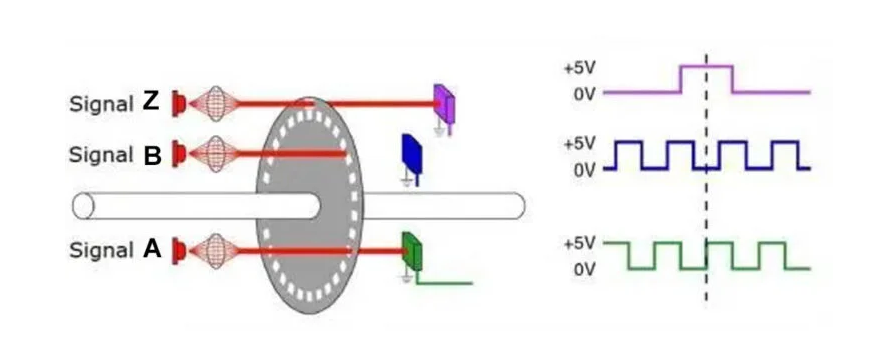
  <br><em>Figure 16 – Optical incremental encoder operating principle: code disc with LED/photodetector pairs generating quadrature signals A and B (90° phase offset), plus index pulse Z (one pulse per revolution)</em>
</p>

An optical incremental encoder consists of three main components:
1. A **code disc** (attached to the rotating shaft) with alternating transparent and opaque segments equally spaced around its circumference.
2. An **infrared LED** light source on one side of the disc.
3. A **photodetector** array on the opposite side.

As the shaft rotates, the alternating transparent and opaque segments pass between the LED and photodetector, alternately allowing and blocking the light beam. The photodetector converts this into a square-wave pulse train. With 1024 transparent slots per revolution, the encoder generates **1024 pulses per revolution** on each channel.

In addition to channels A and B, most quadrature encoders also produce a **Z (index) channel** — a single pulse occurring once per revolution at a fixed angular position. The Z pulse provides an absolute angular reference that can be used to reset the counter and synchronize signal processing to a fixed reference position on the shaft.

**Quadrature Decoding (Channels A and B):**

Channels A and B are mechanically offset so that their pulse trains are displaced by exactly 90° (one-quarter of a pulse period). This quadrature relationship provides two key benefits:

- **Rotation direction detection:** If Channel A leads Channel B (A transitions before B), the shaft is rotating clockwise. If B leads A, the shaft is rotating counter-clockwise. For this experiment, only one rotation direction is used (motor drives in one direction), but direction discrimination is available if needed.

- **4× resolution enhancement:** By detecting all four edge transitions (rising edge of A, falling edge of A, rising edge of B, falling edge of B) within each pulse cycle, the effective angular resolution is quadrupled to **4 × 1024 = 4096 counts per revolution** — equivalent to an angular resolution of 360°/4096 ≈ **0.088° per count**.

**Speed Calculation:**

The instantaneous shaft speed in rpm can be computed by counting pulses over a known time interval:

$$n = \frac{\text{pulse count} \times 60}{PPR \times \Delta t} \quad \text{(rpm)}$$

Or equivalently, the instantaneous period between consecutive pulses can be measured and converted to instantaneous speed for higher time resolution.

In this experiment, Channel A and Channel B are read into the **NI USB-6210** module via the Counter/Timer inputs (PFI0 and PFI1 pins). The LabVIEW DAQmx counter task is configured for quadrature (X4) decoding, which captures all four edge transitions.

---

#### b. Vibration Sensor — PCB Piezotronics 356A32/NC

> [!NOTE]
> **Model Clarification:** A search of the PCB Piezotronics database confirms the correct model number is **356A32/NC** (not 365A32). This is a triaxial ICP® accelerometer by PCB Piezotronics.

<p align="center">
  
  <br><em>Figure 14 – PCB Piezotronics 356A32/NC triaxial ICP® accelerometer</em>
</p>

<p align="center">
  
  <br><em>Figure 15 – Accelerometer wiring and connector detail</em>
</p>

**Purpose:** Measures vibration acceleration along 3 orthogonal axes (X, Y, Z) simultaneously at the rolling bearing housing nearest to the gear under investigation.

**Sensor Type:** IEPE (Integrated Electronics Piezo-Electric), also marketed by PCB Piezotronics under the ICP® (Integrated Circuit Piezoelectric) trademark.

**Operating Principle — IEPE/ICP® Accelerometer:**

The PCB 356A32/NC operates on the **piezoelectric effect**: when a piezoelectric crystal material (typically PZT — Lead Zirconate Titanate — for sensitivity, or quartz for stability) is subjected to mechanical stress caused by inertial acceleration, it generates an electrical charge proportional to the applied force (and hence to the acceleration, since $F = ma$).

The charge-generating mechanism alone is not practical for long-cable measurement systems because:
- Piezoelectric crystal output impedance is extremely high (gigaohms).
- The charge signal is very susceptible to electromagnetic interference (EMI) and cable capacitance effects.

The IEPE design solves these problems by integrating a miniaturized **charge-to-voltage amplifier (JFET-based preamplifier)** directly within the sensor housing. The amplifier converts the high-impedance charge into a **low-impedance voltage output** that can be transmitted over standard coaxial cables up to 100 m or more without significant signal degradation.

**IEPE Power Supply and Signal Coupling:**

The integrated preamplifier inside the sensor requires a DC power supply. In the IEPE standard, this is provided by the DAQ module (or an external signal conditioner) through the **same coaxial cable** that carries the measurement signal — a technique called **current loop powering**:

```
DAQ module (NI USB-9234)
    └─ Constant current source (2–20 mA DC) → through coaxial cable → sensor preamplifier
    └─ AC vibration signal ← superimposed on DC bias ← same coaxial cable ← sensor output
```

The NI USB-9234 supplies a 2 mA constant current and automatically blocks the DC bias using AC coupling, reading only the AC vibration signal superimposed on the DC bias voltage.

**Technical Specifications — PCB 356A32/NC:**

| Parameter | Value |
|:---|:---|
| Model | **356A32/NC** (PCB Piezotronics) |
| Type | Triaxial ICP® Accelerometer |
| Sensing Principle | Piezoelectric IEPE (ICP®) |
| Sensitivity | **100 mV/g** (10.2 mV/(m/s²)) ±10% |
| Measurement Range | ±50 g peak (±491 m/s² peak) |
| Frequency Range (±5%) | **1.0 – 4,000 Hz** |
| Frequency Range (±10%) | 0.7 – 5,000 Hz |
| Resonant Frequency | ≥ 25 kHz |
| Resolution (Noise Floor) | 0.0003 g rms (0.003 m/s² rms) |
| IEPE Excitation Current | 2 – 20 mA |
| Output Bias Voltage | 7 – 16 VDC (Excitation: 24–30 VDC) |
| Mass | 5.4 g (0.19 oz) |
| Connector | 8-36 4-pin receptacle (side exit) |

**Frequency Range Justification:**

The flat frequency response of 1–4,000 Hz covers the key diagnostic frequency ranges for this test rig:
- GMF at 50 Hz input: up to 625 Hz (Stage 1 GMF), well within the flat range.
- Higher harmonics (2×, 3×, 4× GMF) up to 2,500 Hz — also within range.
- Structural resonance frequencies of the gearbox and bearing housing are typically in the range 1–10 kHz, within the ±10% range.
- The accelerometer's resonant frequency (≥25 kHz) is well above the maximum excitation frequency of the rig at 50 Hz input, avoiding resonance amplification errors.

**Mounting Location:** The sensor is mounted directly on the rolling bearing housing at the position closest to the faulty gear under investigation. Mounting at the bearing housing — rather than on the gearbox casing surface — minimizes the vibration transmission path length from the fault source to the sensor, preserving signal amplitude and high-frequency content. A shorter transmission path reduces attenuation and reflection losses in the vibration wave, resulting in a higher signal-to-noise ratio (SNR) at the sensor output.

---

#### c. Proximity Sensor — Bently Nevada 3300 XL NSv Proximity Transducer System

<p align="center">
  
  <br><em>Figure 19 – Eddy‑current proximity probe installed on test rig, aimed radially at the gear surface</em>
</p>

**Purpose:** Measures shaft phase — the instantaneous angular position of the gear relative to a fixed reference point during each revolution. This signal is used for two primary purposes: (1) providing a phase reference for Order Tracking analysis, and (2) enabling angular-domain signal resampling to synchronize vibration data with shaft rotation.

**Equipment Source:** Borrowed from a rotor dynamics test kit provided by Bently Nevada.

**Operating Principle — Eddy-Current Proximity Probe:**

<p align="center">
  
  <br><em>Figure 17 – Eddy-current sensor operating principle: the probe coil (induction coil) generates a high-frequency AC magnetic field; eddy currents induced in the conductive target attenuate the field, and the current sensor detects the impedance change proportional to gap distance</em>
</p>

The eddy-current proximity probe exploits **electromagnetic induction in a conductive target surface**:

1. An oscillator circuit in the proximitor (signal conditioner) drives the **probe coil** (a small coil wound at the probe tip) at a high frequency (typically 200 kHz – 2 MHz).
2. The probe coil generates a **high-frequency alternating magnetic field** that extends a short distance in front of the probe tip.
3. When a **conductive metallic target** (the gear face or shaft surface) is within the field range, the alternating magnetic field induces **eddy currents** in the target surface. These eddy currents, by Lenz's law, create an opposing magnetic field that effectively attenuates the probe coil's field.
4. The attenuation changes the **coil impedance** (effective inductance and Q-factor), which is detected by the oscillator circuit as a change in oscillation amplitude or frequency.
5. The proximitor converts this impedance change into a **DC voltage output** that is linearly proportional to the gap distance between the probe tip and the target surface.

The output voltage decreases as the target approaches (smaller gap → stronger eddy current loading → greater amplitude attenuation → lower output voltage) and increases as the target moves away.

> [!NOTE]
> Eddy-current sensors provide **non-contact, high-bandwidth** shaft position measurement with excellent immunity to contamination (oil, dirt, moisture) and to external magnetic fields. The measurement is purely based on electrical coupling and does not require mechanical contact with the target, making it suitable for continuous operation on rotating machinery.

**Proximity Probe Dimensional Drawing:**

<p align="center">
  
  <br><em>Figure 18 – Bently Nevada proximity probe dimensional drawing, showing probe tip, case thread, hex nut, unthreaded length (A), case length (B), total length (C), and miniature male coaxial connector (D)</em>
</p>

**Phase Measurement Application:**

When the proximity probe is aimed radially at a gear, the varying gap between the probe tip and the gear surface follows the gear tooth profile as the gear rotates:
- **Tooth tips** (shorter gap) → stronger eddy-current loading → **lower output voltage**.
- **Tooth roots/spaces** (larger gap) → weaker eddy-current loading → **higher output voltage**.

The resulting output waveform is a periodic signal with $Z$ cycles per revolution (where $Z$ is the number of gear teeth). From this waveform, the LabVIEW system can extract:

1. **Instantaneous shaft rotational speed** — from the time between successive tooth-tip events.
2. **Angular phase position** of each tooth at every time instant — enabling the vibration signal to be resampled as a function of shaft angle rather than time.
3. **Reference for Order Tracking** — the proximity signal provides the angular position reference needed to perform Computed Order Tracking (COT), which resamples the time-domain vibration data into the angular domain (equal angular increments per sample rather than equal time increments). Order-tracked data has the property that all shaft-harmonic components remain at fixed "order" positions in the order spectrum regardless of speed variation, making fault detection more reliable.

**Power and Signal Chain — RK4 Proximitor Assembly:**

<p align="center">
  
  <br><em>Figure 20 – RK4 Rotor Kit Proximitor Assembly front panel: four PROX OUT BNC connectors (PROX 1–4) and one Kø (keyphasor) output. Each output channel provides conditioned DC voltage proportional to probe gap.</em>
</p>

<p align="center">
  
  <br><em>Figure 21 – RK4 Proximitor Assembly rear panel: PROBE 1–4 input connectors (coaxial, for probe cables), Kø probe input, −Vt and COM power terminals, POWER input terminals (red/black banana jacks)</em>
</p>

<p align="center">
  
  <br><em>Figure 22 – RK4 Motor Speed Controller rear panel (Bently Nevada 149844-01): SPEED PROBE SMA input, CW/CCW direction switch, SLOW ROLL ADJUST, EXTERNAL INPUT (±20VDC), PROX POWER OUTPUT (−Vt and COM), MOTOR OUTPUT, and POWER INPUT connectors</em>
</p>

The complete signal chain for the proximity sensor is:

```
RK4 Motor Speed Controller (Bently Nevada 149844-01)
    └─> PROX POWER OUTPUT (−Vt, COM) → DC power supply to Proximitor Assembly
            └─> Proximitor Assembly (RK4)
                    └─> PROBE 1 input ← coaxial cable ← Proximity Probe (sensing tip)
                    └─> PROX 1 OUT → conditioned DC voltage output → NI USB-9234 (AI3)
```

**Technical Specifications — Bently Nevada 3300 XL NSv:**

| Parameter | Value |
|:---|:---|
| System | Bently Nevada 3300 XL NSv Proximity Transducer |
| Probe Model | Unknown (borrowed from Bently Nevada Rotor Kit) |
| Sensing Principle | Eddy-Current |
| Supply Voltage | **-17.5 VDC to -26 VDC** (nominal -24 VDC), max 12 mA |
| Scale Factor | **7.87 V/mm (200 mV/mil)** nominal (calibrated for AISI 4140 steel targets) |
| Linear Range | **1.5 mm (60 mils)** — from 0.25 mm to 1.75 mm (10 to 70 mils) |
| Output Voltage at Center Gap | -10.0 VDC (recommended gap: ~0.75 mm / 30 mils) |
| Frequency Response | **0 Hz – 10 kHz** (+0, -3 dB) |
| Operating Temperature (Probe) | -51°C to +177°C |
| Operating Temperature (Proximitor) | -51°C to +100°C |

**Mounting Location:** The probe is positioned above the gear, with its central axis directed radially toward the gear center, at the recommended gap distance of approximately 0.75 mm (30 mils) from the gear tooth tip surface at the center position. The probe must be mounted rigidly to avoid probe vibration contributing spuriously to the displacement signal.

> [!NOTE]
> The scale factor of 7.87 V/mm is calibrated for AISI 4140 steel targets. If the gear material is different (e.g., Aluminum Set 3), the actual scale factor will differ because eddy-current sensitivity depends on the target material's electrical conductivity and magnetic permeability. A calibration correction factor should be applied if the proximity signal is used quantitatively for displacement measurement with aluminum gears.

---

#### d. Torque Sensor — JIHSENSE Rotary Torque Sensor RT-2.5 Nm

<p align="center">
  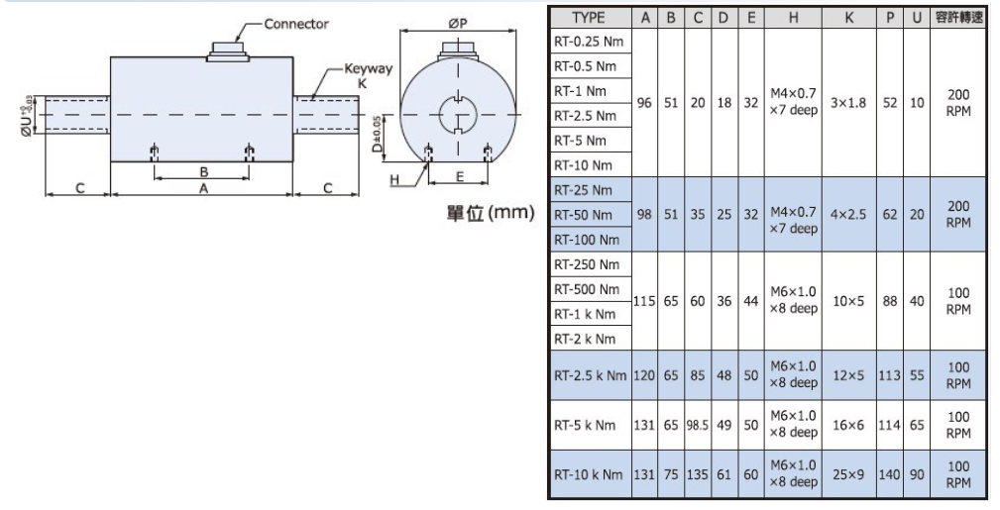
  <br><em>Figure 23 – JIHSENSE rotary torque sensor RT‑2.5 Nm</em>
</p>

**Purpose:** Measures the braking torque applied by the magnetic powder brake to the gearbox output shaft in real time, providing a continuous, quantitative measure of the mechanical load imposed on the gear train during each experiment.

**Operating Principle — Wheatstone Bridge Strain Gauge Torque Measurement:**

This rotary torque sensor operates on the **strain gauge (resistive transducer)** principle combined with a **Wheatstone bridge** circuit:

1. **Strain gauges on the torsion shaft:** Thin-film resistive strain gauges are bonded to a precision-machined elastic torsion shaft at 45° to the shaft axis. This 45° orientation is chosen because shear stress due to torsion produces maximum principal stress at ±45° to the shaft axis — placing the gauges at this angle maximizes sensitivity while minimizing sensitivity to bending and axial loads.

2. **Resistance change under torque:** When the shaft is subjected to torque $T$, it twists elastically. The strain $\varepsilon$ on the gauge surface is proportional to the torque. By the gauge factor relationship, the resistance of the strain gauge changes by:
$$\frac{\Delta R}{R} = GF \times \varepsilon$$
where $GF$ is the gauge factor (typically 2.0–2.1 for metallic strain gauges).

3. **Wheatstone bridge:** Four strain gauges are connected in a full Wheatstone bridge — two gauges oriented along the positive principal stress direction (+45°) and two along the negative (-45°), wired into adjacent arms of the bridge. This configuration doubles the signal output (two active arms in tension, two in compression simultaneously for a given torque direction) and cancels out temperature-induced resistance changes (common-mode rejection), bending loads, and axial loads.

4. **Bridge output:** The bridge imbalance voltage, which is linearly proportional to the applied torque, is typically in the millivolt range per volt of excitation (in this case, 1.0 mV/V rated output). This requires amplification before being read by the DAQ module.

5. **Slip ring signal transmission:** Because the strain gauges are mounted on a rotating shaft, their wiring must be transmitted to the stationary amplifier. This is done via **carbon brush slip rings** — rotating conductive rings on the shaft make sliding contact with fixed carbon brushes, transmitting the four-wire bridge signal to the external amplifier without the need for wireless telemetry.

<p align="center">
  
  <br><em>Figure 24 – Strain gauge Wheatstone bridge detail: four gauges bonded at ±45° to shaft axis; R1 and R3 in tension, R2 and R4 in compression under positive torque direction, forming a full-bridge configuration</em>
</p>

**Technical Specifications — RT-2.5 Nm:**

| Parameter | Value |
|:---|:---|
| Manufacturer | JIHSENSE Industrial |
| Model | RT-2.5 Nm (Rotary Torque Sensor) |
| Measurement Range | 0 – 2.5 N·m |
| Rated Output | 1.0 mV/V |
| Total Error | ±0.3% R.O. |
| Repeatability | ±0.2% R.O. |
| Creep | 0.1%/20 min |
| Input Resistance | 430 Ω or 385 Ω or 350 Ω |
| Output Resistance | 350 Ω |
| Max Excitation Voltage | 20 V |
| Recommended Excitation | 10 V |
| Safe Overload | 150% of rated load |
| Operating Temperature | -10°C to +50°C |
| Temp. Effect on Zero | 0.05% R.O./10°C |
| Temp. Effect on Span | 0.03% Load/10°C |
| Cable Length | 3 m |
| Wiring | Red(+) Exci, Black(-) Exci / Green(+) Sign, White(-) Sign |
| Maximum Speed | 200 rpm (for RT-1 to RT-10 Nm range) |

> [!NOTE]
> The maximum rated speed is **200 rpm**. The gearbox output shaft reaches a maximum of approximately 375 rpm at 50 Hz inverter frequency (1500 rpm / 4:1 ratio). This **exceeds the sensor's rated maximum speed** and may cause increased wear on the slip ring brushes or introduce additional electrical noise into the measurement signal at the highest speed setting. Care should be taken when operating at 50 Hz; it is recommended to limit extended operation at this setting.

**Signal Amplifier — JS-100 Load Cell Amplifier (JIHSENSE):**

The millivolt-level differential output from the torque sensor's Wheatstone bridge (1.0 mV/V × 10 V excitation = 10 mV full-scale output) is far too small to be read accurately by a general-purpose DAQ analog input. The JS-100 amplifier serves as the signal conditioning interface between the sensor and the DAQ:

- **Excitation supply:** Provides the stable 10 VDC (or other selectable voltage) excitation to the Wheatstone bridge, ensuring linearity and repeatability of the bridge output.
- **Differential amplification:** Amplifies the millivolt differential bridge output to a ±5 V, ±10 V, or 4–20 mA range (configurable by internal jumpers or DIP switches) suitable for direct input to the NI USB-6210 analog input.
- **Active noise filtering:** Applies a second-order active low-pass filter to suppress high-frequency noise superimposed on the torque signal.
- **Zero and span adjustment:** Front-panel potentiometers allow zeroing the output at no-load and calibrating the gain (span) to match the measured range.

<p align="center">
  
  <br><em>Figure 25 – JS‑100 load‑cell amplifier (JIHSENSE): provides bridge excitation, differential amplification, and configurable voltage/current output for the torque sensor signal</em>
</p>

**Torque Calculation from Amplifier Output Signal:**

For a 4–20 mA output configuration with load resistance $R_L$ (Ω):

$$U_{out} = I_{out} \times R_L \quad \text{(V)}$$

$$T = \frac{U_{out} - U_{min}}{U_{max} - U_{min}} \times T_{rated} \quad \text{(N·m)}$$

Where $T_{rated} = 2.5$ N·m, and $U_{min}$, $U_{max}$ are the output voltages corresponding to $I_{out} = 4$ mA and $I_{out} = 20$ mA respectively (calculated using the chosen load resistance $R_L$).

**Mounting Location:** The torque sensor is installed in-line on the output side of the gearbox — between the gearbox output shaft and the magnetic powder brake — with jaw couplings on each end. This position ensures that the measured torque is the full braking torque applied to the gear train output, which is the physically meaningful load quantity for the experiment.

---

#### e. Data Acquisition Module — NI USB-9234 (via Prowave PW700 Converter)

> [!NOTE]
> This module is the **NI USB-9234**, connected to the PC via a **Prowave PW700 Series** RS-232-to-USB converter. The combined unit is sometimes referred to as "NI PW9234A" in local documentation.

<p align="center">
  
  <br><em>Figure 26 – NI USB‑9234 Dynamic Signal Acquisition module (4-channel, 24-bit, 51.2 kS/s, with per-channel IEPE excitation)</em>
</p>

<p align="center">
  
  <br><em>Figure 27 – NI USB‑9234 single-channel wiring diagram: constant current source (IEPE) on the coaxial signal line powers the accelerometer preamplifier; AC coupling removes the DC bias at the ADC input</em>
</p>

**Introduction:**

The NI USB-9234 is a **Dynamic Signal Acquisition (DSA)** module from National Instruments, specifically designed for sound and vibration measurements. It is distinguished from general-purpose analog input modules (such as the NI USB-6210) by two key features:

1. **Per-channel software-selectable IEPE excitation:** Each channel can independently source the constant DC current required to power an IEPE/ICP® accelerometer, eliminating the need for a separate signal conditioner.
2. **Built-in automatic anti-aliasing filter:** Each channel has a hardware low-pass filter that is automatically adjusted as the sampling rate is changed, ensuring compliance with the Nyquist sampling theorem at all times without manual filter adjustment.

Additionally, the NI USB-9234 uses **24-bit delta-sigma ADC**, providing extremely low noise floor and high dynamic range — critical for capturing both the large-amplitude fundamental gear mesh frequencies and the small-amplitude early-stage fault sidebands simultaneously within the same acquisition.

**Technical Specifications — NI USB-9234:**

| Parameter | Value |
|:---|:---|
| Manufacturer | National Instruments (NI) |
| Analog Input Channels | 4 channels (AI0 – AI3), simultaneous sampling |
| Maximum Sample Rate | 51.2 kS/s per channel |
| ADC Resolution | 24 bit |
| Input Voltage Range | ±5 V |
| IEPE Support | Yes — software-selectable per channel |
| IEPE Excitation Current | 2 mA (typical) |
| Coupling | AC or DC — software-selectable per channel |
| Physical Connector | BNC (one BNC per channel) |
| PC Interface | USB (via Prowave PW700 RS-232→USB converter) |
| Anti-Aliasing Filter | Built-in automatic anti-aliasing filter |

**Sampling Rate Selection:**

The maximum sample rate of **51.2 kS/s** per channel provides a Nyquist frequency of **25.6 kHz** — well above the accelerometer's useful frequency range (upper limit 5 kHz at ±10%) and above the accelerometer's resonant frequency (~25 kHz). For this experiment, a sample rate of **25.6 kS/s** per channel (Nyquist: 12.8 kHz) is typically sufficient to capture all relevant vibration frequencies, including structural resonances and high-order GMF harmonics.

**Channel Wiring:**

| Sensor | DAQ Channel | Coupling | IEPE |
|:---|:---:|:---:|:---:|
| Accelerometer X-axis | AI0 | AC | ON |
| Accelerometer Y-axis | AI1 | AC | ON |
| Accelerometer Z-axis | AI2 | AC | ON |
| Proximity Sensor | AI3 | DC | OFF |

> [!NOTE]
> The proximity sensor outputs a DC-coupled voltage signal (the DC level represents the mean gap, and the AC component encodes the tooth profile). Therefore, AI3 must be configured for **DC coupling** with **IEPE off** — the proximity sensor is powered by the Bently Nevada proximitor, not by the DAQ module.

---

#### f. Data Acquisition Module — NI USB-6210

<p align="center">
  
  <br><em>Figure 28 – NI USB‑6210 M-Series multifunction DAQ (16-bit, 250 kS/s, 16 AI channels, 2× 32-bit counters)</em>
</p>

<p align="center">
  
  <br><em>Figure 29 – NI USB‑6210 screw terminal pinout: AI channels (differential and single-ended), digital I/O lines, and PFI counter/timer inputs</em>
</p>

**Introduction:**

The NI USB-6210 is a general-purpose **M-Series Multifunction DAQ** device from National Instruments. Unlike the NI USB-9234 (which is specialized for AC vibration measurement), the USB-6210 provides both **analog voltage input** (for the torque amplifier output) and **digital counter/timer input** (for the encoder quadrature pulse signals) — making it the appropriate choice for reading the DC-range torque signal and the digital pulse-train encoder signals.

The NI USB-6210 uses a **16-bit successive approximation register (SAR)** ADC with a maximum sample rate of **250 kS/s** (aggregate, shared among all active analog input channels). At 16-bit resolution, it provides a voltage resolution of approximately $20 \text{ V} / 2^{16} \approx 305 \text{ μV}$ at ±10 V range, or about 76 μV at ±5 V range — fully adequate for reading the amplified torque signal which spans 0–5 V or 0–10 V.

**Technical Specifications — NI USB-6210:**

| Parameter | Value |
|:---|:---|
| Manufacturer | National Instruments (NI) |
| Analog Input Channels | 16 single-ended (RSE/NRSE) or 8 differential (DIFF) |
| Maximum Sample Rate | 250 kS/s |
| ADC Resolution | 16 bit |
| Input Voltage Range | Software-selectable: ±0.2 V, ±1 V, ±5 V, ±10 V |
| Digital I/O | 8 lines (4 DI + 4 DO), 5V TTL/CMOS |
| Counter/Timer | 2 × 32-bit counters, 80 MHz max source frequency |
| PFI Pins | 8 Programmable Function Interface pins (usable as counter inputs) |
| Physical Connector | 68-pin connector or screw terminal block |
| PC Interface | USB |

**Channel Wiring:**

| Signal | NI USB-6210 Terminal | Configuration |
|:---|:---:|:---|
| Encoder Channel A | PFI0 | Counter 0 source (A input for X4 quadrature) |
| Encoder Channel B | PFI1 | Counter 0 Z input (B input for X4 quadrature) |
| Encoder GND | DGND | Digital ground reference |
| Torque Amplifier Output (+) | AI0+ | Differential analog input |
| Torque Amplifier Output (–) | AI0– | Differential analog input |

The torque signal is wired in **differential mode** (not single-ended) to suppress common-mode electrical noise from the rotating machinery and power electronics in the vicinity of the test rig. The encoder signals are wired to PFI pins configured as a **32-bit quadrature (X4) counter** input — the counter accumulates position counts continuously, and the LabVIEW program reads and differences consecutive counter readings to compute the instantaneous speed.

---

## PART 3: LABVIEW PROGRAMMING

### 3.1. Introduction to LabVIEW

LabVIEW (Laboratory Virtual Instrument Engineering Workbench) is a graphical dataflow programming environment developed by National Instruments, specifically designed for data acquisition, instrument control, signal processing, and test automation in laboratory and industrial settings. Rather than writing text-based code, the programmer creates a **Block Diagram** by connecting functional nodes (called VIs — Virtual Instruments) with colored data wires that represent different data types.

Each LabVIEW program is itself called a **Virtual Instrument (VI)** and consists of two tightly coupled components:

- **Front Panel:** The interactive user interface — equivalent to the front panel of a physical instrument. Contains control objects (knobs, slide controls, numeric input boxes, start/stop buttons) for the operator to configure the experiment, and indicator objects (waveform graphs, numeric displays, status LEDs) for real-time visualization of the measurement data.

- **Block Diagram:** The graphical programming canvas (the "source code"). Nodes representing functions (mathematical operations, DAQmx API calls, file I/O, signal processing algorithms) are connected by wires that carry data from output terminals to input terminals, following the **dataflow programming paradigm**: a node executes as soon as all of its input data are available, and execution flows from left to right through the wiring pattern.

LabVIEW is particularly well-suited for this experiment because:
1. NI provides the **NI-DAQmx driver** that exposes all DAQ hardware capabilities as native LabVIEW VIs, including IEPE control, hardware timing, counter configuration, and multi-device synchronization.
2. LabVIEW's **Parallel Loop** architecture naturally supports the Producer–Consumer pattern required for simultaneous high-speed data acquisition and file writing.
3. Built-in signal processing VIs (FFT, filtering, windowing, RMS computation) reduce development time for in-loop signal monitoring.

---

### 3.2. DAQ Assistant vs. DAQmx API

LabVIEW provides two approaches for interfacing with NI DAQ hardware:

| Criterion | DAQ Assistant | DAQmx API |
|:---|:---|:---|
| Creation Method | Drag-and-drop with graphical configuration wizard | Manual programming with DAQmx function library |
| Configurability | Limited — does not allow deep configuration | Full control over clock, trigger, buffer, and per-channel settings |
| Multi-device Support | Limited | Full — supports synchronization across multiple modules |
| IEPE Per-Channel Control | Not fully supported | Fully supported via `DAQmx Channel Properties` |
| Counter/Quadrature | Basic only | Full X1/X2/X4 quadrature encoding, 32-bit accumulation |
| Best For | Quick prototyping and testing | Rigorous experiments with multi-channel, multi-device setups |

**Why DAQmx API is Required for This Experiment:**

This measurement system uses **2 different DAQ modules** (NI USB-9234 and NI USB-6210) and **4 distinct signal types** simultaneously:
- IEPE vibration signals (3 channels, require per-channel IEPE ON, AC coupling)
- Proximity DC voltage signal (1 channel, requires IEPE OFF, DC coupling)
- Torque analog voltage signal (1 differential channel, general-purpose AI)
- Encoder quadrature pulse signals (2 digital channels → 1 counter task, X4 decoding)

The **DAQ Assistant** does not support:
- Mixing IEPE and non-IEPE channels within the same task configuration.
- Hardware-clock synchronization across two different USB DAQ devices.
- High-resolution quadrature decoder counter configuration.

The **DAQmx API** provides all of these through its comprehensive programming interface, making it the only appropriate choice for this experiment.

---

### 3.3. Front Panel Description

<p align="center">
  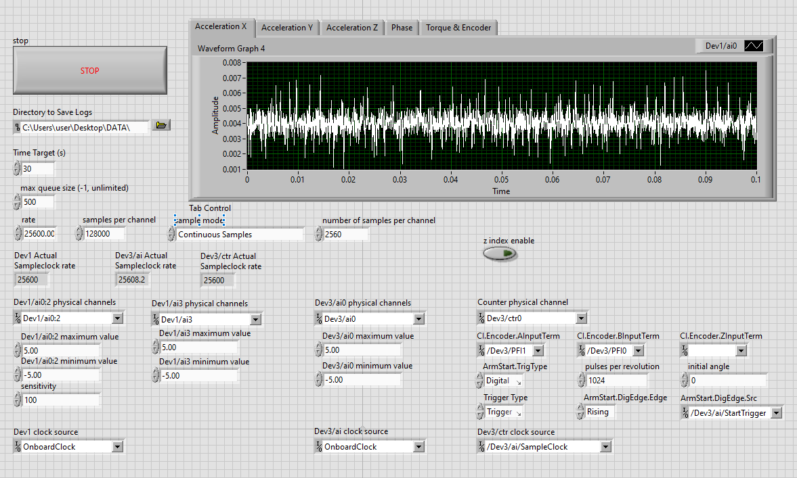
  <br><em>Figure 30 – LabVIEW VI Front Panel: acquisition controls (left column), real-time waveform display (top-right tab panel), and DAQ channel/trigger configuration parameters (bottom row)</em>
</p>

The front panel is divided into three functional zones:

#### a. Global Acquisition Controls (left column)

| Control | Value in Use | Description |
|:---|:---:|:---|
| **STOP** | — | Stops the acquisition loop; triggers the shutdown sequence (sentinel value → Consumer finishes writing → Cleanup phase) |
| **Directory to Save Logs** | `C:\Users\user\Desktop\DATA\` | Root directory where TDMS files are saved |
| **Time Target (s)** | `30` | Target acquisition duration. When the internal `Elapsed Time` timer reaches this value, the Producer loop exits and triggers graceful shutdown |
| **max queue size (-1, unlimited)** | `500` | Maximum data chunks the RAM queue may hold. Set to 500 to cap memory use; `-1` = unlimited buffering |
| **rate** | `25600.00` | Sample rate in S/s for Dev1 (NI USB-9234). Master clock rate that all channels are referenced to |
| **samples per channel** | `128000` | Total samples per channel per session (= 25600 × 30 s). Informational only — actual stop is controlled by `Time Target` |
| **sample mode** | `Continuous Samples` | Instructs DAQmx to acquire indefinitely (circular hardware buffer) until explicitly stopped |
| **number of samples per channel** | `2560` | Samples read per `DAQmx Read` call = `25600 × 0.1 s` = **100 ms per read block** (chunk size moved from FIFO to Producer each iteration) |
| **z index enable** | OFF (LED) | Enables encoder Z-index pulse for absolute position reset. Currently disabled — only relative angular tracking needed |

#### b. Actual Sample Rate Indicators (read-only)

| Indicator | Value | Description |
|:---|:---:|:---|
| **Dev1 Actual Sampleclock rate** | `25600` | Hardware-confirmed rate of NI USB-9234 AI task (matches commanded `rate`) |
| **Dev3/ai Actual Sampleclock rate** | `25608.2` | Actual rate of NI USB-6210 AI task. The **+8.2 Hz discrepancy** is the measured inter-device clock drift — the fundamental limitation of software synchronization (see Section 3.6) |
| **Dev3/ctr Actual Sampleclock rate** | `25600` | Actual rate of counter task — matches Dev1's rate because counter clock source is `/Dev3/ai/SampleClock` (see Section 3.5) |

#### c. NI USB-9234 (Dev1) — Vibration + Phase Channels

| Parameter | Value | Meaning |
|:---|:---:|:---|
| **Dev1/ai0:2 physical channels** | `Dev1/ai0:2` | Channels 0, 1, 2 → Accelerometer X, Y, Z (IEPE, AC-coupled) |
| **Dev1/ai0:2 max/min value** | `±5.00 V` | Voltage range for IEPE accelerometer signal |
| **sensitivity** | `100` | Sensor sensitivity in mV/g; used for engineering unit conversion in post-processing |
| **Dev1/ai3 physical channels** | `Dev1/ai3` | Channel 3 → Proximity sensor output (Phase/timing signal, DC-coupled, IEPE OFF) |
| **Dev1/ai3 max/min value** | `±5.00 V` | Proximity sensor DC output range |
| **Dev1 clock source** | `OnboardClock` | Dev1 uses its internal crystal oscillator as the master timing reference |

#### d. NI USB-6210 (Dev3) — Torque Channel

| Parameter | Value | Meaning |
|:---|:---:|:---|
| **Dev3/ai0 physical channels** | `Dev3/ai0` | Channel 0 → Torque sensor JS-100 amplifier output (AI Voltage, differential) |
| **Dev3/ai0 max/min value** | `±5.00 V` | Range matching JS-100 amplifier ±5 V output |
| **Dev3/ai clock source** | `OnboardClock` | Dev3 uses its own onboard oscillator (software-synchronized to Dev1 via Flat Sequence — see Section 3.6) |

#### e. Encoder Counter Configuration — NI USB-6210 Dev3/ctr0

| Parameter | Value | Meaning |
|:---|:---:|:---|
| **Counter physical channel** | `Dev3/ctr0` | Counter 0 of NI USB-6210 — configured as CI Angular Encoder |
| **CI.Encoder.AInputTerm** | `/Dev3/PFI1` | Encoder Channel A wired to PFI1 pin |
| **CI.Encoder.BInputTerm** | `/Dev3/PFI0` | Encoder Channel B wired to PFI0 pin |
| **CI.Encoder.ZInputTerm** | *(empty)* | Z-index not connected (z index enable = OFF) |
| **pulses per revolution** | `1024` | Matches encoder's 1024 PPR optical disc |
| **initial angle** | `0` | Counter resets angular position to 0° at task start |
| **ArmStart.TrigType** | `Digital` | Counter uses a **Digital Arm Start** trigger — a two-stage mechanism: (1) Arm enables counter hardware registers; (2) the incoming trigger pulse fires the actual start |
| **ArmStart.DigEdge.Edge** | `Rising` | Arm trigger fires on rising edge |
| **ArmStart.DigEdge.Src** | `/Dev3/ai/StartTrigger` | **Key:** Counter is armed by Dev3's own AI task Start Trigger — ensures counter and torque AI start at the exact same hardware moment |
| **Dev3/ctr clock source** | `/Dev3/ai/SampleClock` | **Key:** Counter borrows the Dev3 AI Sample Clock — details in Section 3.5 |
| **Trigger Type** | `Trigger` | Arms the counter in trigger-wait mode (not software-triggered) |

> [!NOTE]
> The **Digital Arm Start** mechanism used by counter tasks is architecturally distinct from a standard Start Trigger. Unlike AI tasks (which accept a single Start Trigger directly), Counter Input tasks require this two-stage control: the **Arm** stage pre-enables the counting hardware registers, and the subsequent trigger derived from `/Dev3/ai/StartTrigger` fires the actual start. This is necessary because CI tasks do not natively accept `DAQmx Start Trigger` in the same way as AI tasks.

---

### 3.4. DAQmx Task Creation Workflow

A DAQmx acquisition task in LabVIEW follows a standardized lifecycle. For each signal group, a separate task is created and managed:

```
1. DAQmx Create Task           → Instantiate a new named task object

2. DAQmx Create Virtual Channel → Define one virtual channel per physical sensor
                                   For AI (voltage/IEPE): device, terminal, coupling,
                                   IEPE on/off, measurement range
                                   For Counter: device, counter number,
                                   decoding type (X4), Z index settings

3. DAQmx Timing (Sample Clock)  → Configure the hardware sample clock:
                                   - Sample rate (25,600 S/s for Dev1)
                                   - Samples per read (2560 = 100 ms per block)
                                   - Acquisition mode: Continuous Samples
                                   For counter: clock source = /Dev3/ai/SampleClock

4. DAQmx Trigger (Counter only) → ArmStart: Digital Edge, Rising,
                                   Source = /Dev3/ai/StartTrigger
                                   (Arms counter to start when Dev3 AI task begins)

5. DAQmx Start Task (×3)        → All three tasks started in same Flat Sequence frame
                                   Order: Dev1 AI → Dev3 AI → Dev3 Counter
                                   (software synchronization — see Section 3.6)

6. DAQmx Read (in Producer loop)→ Transfer data from hardware FIFO to PC RAM
                                   (every 100 ms per read block)

7. Enqueue Data                 → Push 6-channel data cluster to Queue

8. Dequeue + Write File         → Consumer loop retrieves and writes TDMS

9. DAQmx Stop Task              → Signal hardware to stop after current buffer
10. DAQmx Clear Task            → Release hardware resources
```

The **hardware buffer** (FIFO in the DAQ module) acts as the first buffer between the ADC and the PC. If `DAQmx Read` does not retrieve data fast enough, a **buffer overrun** error occurs and data is lost. The Producer–Consumer architecture prevents this.

---

### 3.5. Counter Timing Solution — External Sample Clock for NI USB-6210

**Problem: No Dedicated Counter Sample Clock**

The NI USB-6210 provides 32-bit hardware counters capable of quadrature decoding, but these counters **do not have their own dedicated sample clock**. In default on-demand mode, the counter only returns a count when software explicitly requests it — resulting in software-timed, non-deterministic sample intervals. This makes accurate instantaneous speed computation impossible from the raw count differences.

**NI Official Solution: Borrow the AI Sample Clock**

NI's DAQmx example library provides an official pattern for this scenario: **"Read Encoder (Continuously Clock)"** — configuring the counter's sample clock source as the analog input Sample Clock from the same device. This links counter sampling to the AI timing engine, so encoder position is captured at exactly the same hardware clock pulses as the analog channels.

<p align="center">
  
  <br><em>Figure 31 – NI DAQmx example: "Read Encoder (Continuously Clock)". Four stages: Channel Settings (CI Angular Encoder, A/B/Z terminals), Timing Settings (Sample Clock Source = /Dev3/ai/SampleClock), Trigger Settings (Digital Arm Start triggered by /Dev3/ai/StartTrigger), and Acquire Data loop (Counter 1D DBL 1Chan NSamp).</em>
</p>

The example (Figure 31) demonstrates four stages:
1. **Channel Settings:** Create CI Angular Encoder channel; specify A/B/Z PFI terminal pins and pulses-per-revolution.
2. **Timing Settings:** `Sample Mode = Continuous Samples`; **`Sample Clock Source = /Dev3/ai/SampleClock`** (the critical setting — links counter timing to the AI task's hardware clock).
3. **Trigger Settings:** `ArmStart.TrigType = Digital Edge`; `Source = /Dev3/ai/StartTrigger`; `Edge = Rising`. Ensures counter starts at the precise hardware moment the AI task begins.
4. **Acquire Data:** `Counter 1D DBL, 1Chan NSamp` read in a While Loop, returning accumulated angular position values at each AI sample clock pulse.

**Result:** The counter's `Dev3/ctr Actual Sampleclock rate = 25600` (matching Dev3 AI exactly), confirming that the clock-borrowing is active. Torque and encoder readings are therefore **sample-accurate** with respect to each other within the NI USB-6210.

---

### 3.6. Inter-Device Synchronization — Software Method via Flat Sequence

**Hardware Synchronization Constraints**

The ideal synchronization method would route a hardware trigger or shared sample clock from NI USB-9234 (Dev1) to NI USB-6210 (Dev3) via a physical wire. This is **not currently feasible** due to two hardware constraints:

1. **Connector incompatibility:** The NI USB-9234 exposes only **BNC connectors** for signal I/O, while the NI USB-6210's PFI digital I/O uses a **68-pin screw terminal block**. No BNC-to-terminal adapter is available in the current setup.

2. **No clock output pin on USB-9234 standalone:** When used without a cDAQ chassis, the NI USB-9234 does not expose a routable sample clock output terminal — the internal clock is only accessible via the chassis backplane, which does not apply here.

**Implemented Solution: Software Synchronization via Flat Sequence**

Given these hardware constraints, the implementation follows the NI-documented software synchronization approach: all three `DAQmx Start Task` calls are placed within a **single Flat Sequence frame** to minimize (but not eliminate) inter-device startup latency.

<p align="center">
  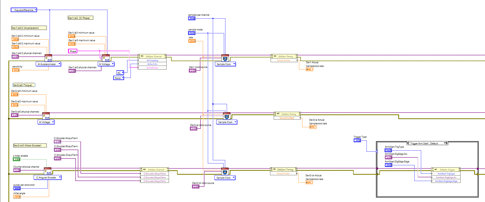
  <br><em>Figure 32 – Block Diagram 1 (Initialization frame): Three parallel task configuration chains — Dev1 AI (accelerometer + phase), Dev3 AI (torque), Dev3 Counter (encoder) — each with DAQmx Create Channel → DAQmx Timing → (counter only) DAQmx Trigger. All three DAQmx Start Task calls execute within one Flat Sequence frame for software synchronization.</em>
</p>

**Comparison: Software vs. Hardware Synchronization**

| Aspect | Software Sync (Flat Sequence, implemented) | Hardware Sync (PFI wire, not feasible) |
|:---|:---:|:---:|
| Startup jitter between Dev1 and Dev3 | ~1–10 ms (OS-dependent) | Sub-microsecond |
| Clock drift over 30 s session | Yes (observed: +8.2 Hz on Dev3) | No — shared physical clock |
| Implementation complexity | Simple, no extra hardware | Requires BNC-to-terminal adapter + DAQmx routing |
| Feasible with current hardware | ✅ Yes | ❌ No (connector/hardware limitation) |

> [!IMPORTANT]
> The Flat Sequence method does **not** achieve sample-accurate synchronization between Dev1 and Dev3. The `Dev3/ai Actual Sampleclock rate = 25608.2` (vs Dev1's 25600.0) confirms both devices run on independent oscillators with a measurable +8.2 Hz offset. Over a 30-second session, this drift accumulates to approximately **246 samples** of relative offset between the vibration stream (Dev1) and the torque/encoder stream (Dev3). Post-processing must account for this using the angular reference provided by the proximity sensor signal.

**Internal Synchronization within Dev3: Hardware-Accurate**

Within the NI USB-6210 itself, the torque AI channel and encoder counter are **hardware-synchronized**: the counter uses `/Dev3/ai/SampleClock` as its clock source and `/Dev3/ai/StartTrigger` as its arm trigger (Section 3.5). Torque and encoder readings are therefore sample-accurate with respect to each other, regardless of the offset between Dev1 and Dev3.

---

### 3.7. LabVIEW Program Workflow

The complete VI is structured as a **three-phase Flat Sequence** at the top level. The key principle of this structure — that all nodes within a single frame must complete before data exits the frame — is what enforces the software synchronization between acquisition tasks, as shown in Figure 33 below.

<p align="center">
  
  <br><em>Figure 33 – Flat Sequence structure in LabVIEW: two AI tasks (physical channels 0 and 1) each configured with DAQmx Create Channel, DAQmx Timing (Sample Clock), DAQmx Start Task, DAQmx Read, and DAQmx Clear Task — all within a single sequence frame. The annotation reads: <strong>"Both DAQmx Start Task VIs must execute before data will exit the structure, thus both tasks will start at relatively the same time."</strong> This illustrates the software synchronization principle applied in this experiment.</em>
</p>

The three-phase workflow of the VI is as follows (detailed block diagrams are provided in Appendix A):

**Frame 0 — Task Initialization (see Figure A1):**

| Task | Device | Channels | Clock Source | Sync Mechanism |
|:---|:---:|:---|:---:|:---|
| **Dev1 AI** | USB-9234 | ai0:2 (Accel X/Y/Z) + ai3 (Phase) | `OnboardClock` @ 25,600 S/s | Master (no trigger) |
| **Dev3 AI** | USB-6210 | ai0 (Torque) | `OnboardClock` @ ~25,600 S/s | Software (Flat Sequence) |
| **Dev3 Counter** | USB-6210 | ctr0 (Encoder) | `/Dev3/ai/SampleClock` | Hardware-armed by `/Dev3/ai/StartTrigger` |

All three tasks are started within the same Flat Sequence frame to minimize inter-device startup latency (software synchronization — see Section 3.6).

**Frame 1 — Parallel Acquisition (see Figures A2 & A3):**

The Producer loop runs continuously at the hardware rate:
1. `DAQmx Read` (Analog 1D Wfm NChan NSamp) ← Dev1 AI → 4-channel waveform [AccX, AccY, AccZ, Phase]
2. `DAQmx Read` (Analog Wfm 1Chan NSamp) ← Dev3 AI → torque waveform
3. `DAQmx Read` (Counter 1D DBL 1Chan NSamp) ← Dev3 Counter → encoder angular position array
4. `Split Signals` separates the 4-channel vibration array into individual named waveforms
5. Data cluster `{AccX, AccY, AccZ, Phase, Torque, Encoder}` assembled and enqueued
6. Waveform graphs on front panel updated (5-tab Tab Control)
7. `Elapsed Time` compared with `Time Target (s)` → stops loop when duration reached

The Consumer loop runs in parallel:
1. `Dequeue Element` retrieves 6-channel data cluster (blocks if queue empty)
2. `Bundle` VI assembles channels in named order
3. `Write To Measurement` appends bundle to TDMS file
4. Continues until Producer enqueues stop sentinel (empty cluster)

**Frame 2 — Cleanup:** DAQmx Stop/Clear ×3 → Release Queue → Error display

---

### 3.8. Producer–Consumer Architecture

The data acquisition software employs the **Producer–Consumer design pattern**, a well-established concurrent programming architecture recommended by National Instruments for high-throughput DAQ applications [[NI, 2021]](https://www.ni.com/en/support/documentation/supplemental/21/producer-consumer-architecture-in-labview0.html). This pattern decouples data acquisition from data storage, enabling both operations to proceed simultaneously without either blocking the other.

<p align="center">
  
  <br><em>Figure 32 – Producer–Consumer architecture in LabVIEW (NI documentation). The Producer loop generates data and places it into the queue via Enqueue Element; the Consumer loop retrieves data via Dequeue Element and processes it. An Obtain Queue VI creates the shared queue reference before both loops begin.</em>
</p>

As shown in Figure 32, the architecture consists of two parallel While Loops connected by a **LabVIEW Queue** data structure:

**Producer Loop** — runs at the hardware-controlled acquisition rate:
- Reads data from the DAQ hardware (NI USB-9234 and NI USB-6210) using `DAQmx Read.vi`.
- Packages all 6 measurement channels (Acceleration X/Y/Z, Phase, Torque, Encoder) into a data cluster.
- Calls `Enqueue Element.vi` to deposit each data chunk into the queue.
- The `DAQmx Read` call paces the loop — it blocks until the requested number of samples is available from the hardware FIFO (100 ms per read block at 25,600 S/s), eliminating the need for an explicit wait function.

**Consumer Loop** — runs on a separate OS thread in parallel:
- Calls `Dequeue Element.vi` to retrieve data chunks from the queue.
- If the queue is empty, `Dequeue Element` blocks efficiently without consuming CPU cycles.
- Writes retrieved data to a TDMS file using `Write To Measurement.vi`.

**Queue (Shared Data Buffer):**
The queue acts as a FIFO (First-In, First-Out) buffer in PC RAM that absorbs temporary rate mismatches between the two loops. If the Consumer is momentarily slower (e.g., during a disk write burst), data accumulates in the queue rather than being lost. The `max queue size` is set to 500 chunks, capping RAM buffer at 500 × 100 ms = **50 seconds of data**.

**Comparison: With and Without Producer/Consumer:**

| Concern | Without Producer/Consumer | With Producer/Consumer |
|:---|:---:|:---:|
| File write latency impacts DAQ | Yes — data loss during slow writes | No — Producer never blocked |
| Hardware FIFO overflow | High risk at sustained high rates | Eliminated — data moved to RAM immediately |
| Real-time display | Competes with file write | Separate update in Producer loop |
| Shutdown data completeness | Risk of truncated files | Guaranteed by sentinel pattern |

**Shutdown Mechanism:**
When the acquisition duration (`Time Target`) is reached or the operator presses STOP, the Producer loop enqueues a **sentinel value** (empty cluster) as the final element and exits. The Consumer detects the sentinel, flushes all remaining queued chunks to the TDMS file, then exits. The cleanup frame then releases all DAQmx task resources and queue memory.

**Data Output Format:**
All measurement data is stored in **TDMS format** (Technical Data Management Streaming), NI's standard binary time-series format. Each file is self-describing, containing per-channel waveform data (with absolute timestamps `t0` and sample interval `dt`), the configured sample rate, and custom metadata attributes (speed level, load level, gear set, fault type) for post-processing in MATLAB, Python (`nptdms`), or LabVIEW.

---

## PART 4: RESULTS, LIMITATIONS, AND FUTURE WORK

### 4.1. Results Achieved

The following milestones have been completed in the current phase of the project:

1. **Full hardware assembly:** The test rig has been fully assembled, including the motor, VFD, synchronous belt drive, 2-stage gearbox, torque sensor, jaw couplings, magnetic powder brake, and all sensor mounting hardware.

2. **Sensor integration:** All four sensor types (triaxial IEPE accelerometer, Bently Nevada eddy-current proximity probe, JIHSENSE rotary torque sensor + JS-100 amplifier, and optical incremental encoder) have been wired and confirmed to produce valid signals at all five speed settings.

3. **DAQ system configuration:** Both NI USB-9234 (IEPE vibration + proximity) and NI USB-6210 (torque + encoder) modules have been configured and verified using NI MAX (Measurement & Automation Explorer).

4. **LabVIEW data acquisition program:** A LabVIEW VI has been developed using the DAQmx API with the Producer–Consumer architecture, capable of simultaneously reading all measurement channels and writing data to TDMS files. The program provides real-time waveform display on the front panel during acquisition.

5. **Preliminary data collection:** Initial datasets have been collected with the Set 1 (healthy) gear set at multiple speed and load combinations, confirming that the system is operational and that all sensor channels contain meaningful signals.

---

### 4.2. Current Limitations and Challenges

| # | Issue | Details |
|:---:|:---|:---|
| 1 | **Missing material specifications** | The materials of the bearing housings, shafts, pulleys, and gear set 4 have not been fully identified. This limits the ability to construct accurate structural models or perform stress analysis to predict failure modes and resonance frequencies. |
| 2 | **Shaft alignment not verified** | Geometric alignment of all shafts (motor – belt – gearbox – torque sensor – brake) and bearing preload conditions have not been rigorously verified. Residual misalignment introduces additional vibration components (typically at 1× and 2× shaft frequency) that may interfere with gear fault signatures and reduce diagnostic accuracy. |
| 3 | **Manual brake load control** | The magnetic powder brake exciting voltage is currently adjusted manually via a rotary resistor (potentiometer). This approach lacks the precision and repeatability required for systematic experiments — small variations in the resistor setting produce uncontrolled differences in braking torque between sessions, making it difficult to replicate exact loading conditions or to execute a defined load profile. |
| 4 | **Inter-device time synchronization not implemented** | The NI USB-9234 uses a **Delta-Sigma (DSA) ADC** architecture with internal oversampling clocks and digital anti-aliasing decimation filters. The NI USB-6210 uses a **SAR (Successive Approximation Register) ADC** that samples instantaneously on each clock edge. These are fundamentally different architectures: (a) they require different clocking signals — the USB-9234 needs a shared Master Timebase and Sync Pulse in addition to a Start Trigger; (b) the USB-9234 has a fixed digital filter group delay that the USB-6210 does not — this introduces a fixed time offset between their data streams that must be compensated in post-processing. Currently, no hardware trigger or shared clock connects the two USB devices, so they start at slightly different times and their clocks drift over the session duration. |
| 5 | **Output shaft speed may exceed torque sensor maximum** | The theoretical synchronous speed at 50 Hz is 1500 rpm, but preliminary encoder measurements indicate the actual motor shaft speed at 50 Hz (no-load) is approximately **1300+ rpm**. After the 4:1 gearbox reduction, the output shaft speed is estimated at **~325+ rpm** — already exceeding the torque sensor's rated maximum speed of **200 rpm**, even under no-load conditions. Under load, speed will decrease, which may bring operation closer to or within the safe range at lower inverter frequency settings. The actual output shaft speed must be measured and confirmed across all operating conditions (speed levels × load levels) to define a safe operating envelope before conducting extended experiments at high speed settings. |

---

### 4.3. Future Work

The following improvements are planned to address the identified limitations and to extend the experimental capability of the test rig:

1. **Implement hardware synchronization between NI USB-9234 and NI USB-6210:**

   Because both devices are standalone USB modules (not housed in a shared cDAQ chassis), they do not share a backplane — physical **PFI wiring** is required to route timing signals between them. The recommended synchronization procedure based on NI documentation (`ni.com/en/support/documentation/supplemental/21/signal-based-synchronization-of-analog-input-c-series-modules-wi.html`) is:

   - **Step 0 — Verify signal routing in NI MAX:** Open NI Measurement & Automation Explorer (MAX), select the device, and use the **Device Routes** tab to identify exactly which PFI terminals can carry clock and trigger signals on each USB device. Use the `Get Terminal Name with Device Prefix.vi` in LabVIEW to programmatically construct device-prefixed terminal name strings (e.g., `/Dev1/PFI0`) to avoid hardcoding errors.

   - **Step 1 — Route Start Trigger via PFI wire:** Use `DAQmx Export Signal.vi` (or `DAQmx Connect Terminals.vi`) in the LabVIEW initialization code to export the NI USB-9234's `ai/StartTrigger` to a physical PFI output pin. Connect this pin by wire to a PFI input pin on the NI USB-6210. Configure the USB-6210 DAQmx task's Start Trigger source to receive this external hardware trigger. This ensures both devices begin acquiring samples in response to the same physical pulse edge.

   - **Step 2 — Enforce Slave-before-Master startup:** Start the USB-6210 task (Slave) first — it arms and waits on the PFI trigger input. Then start the USB-9234 task (Master) — it begins acquisition and simultaneously emits the hardware Start Trigger. Use **error-wire chaining** (preferred LabVIEW practice) or a Flat Sequence Structure to enforce this order.

   - **Step 3 — Compensate for Delta-Sigma filter delay in post-processing:** The NI USB-9234's internal digital anti-aliasing decimation filter introduces a fixed, known group delay that depends on the configured sample rate. This delay is absent in the USB-6210's SAR ADC. Two approaches to determine and compensate for this offset:
     - **Lookup method:** Consult the NI USB-9234 specifications for the group delay at the programmed sample rate; subtract this fixed offset from the USB-9234 `t0` timestamps in post-processing before cross-plotting channels.
     - **Cross-correlation method:** Feed a known reference signal (e.g., the encoder pulse train or a generated test tone) simultaneously into both devices. Compute the cross-correlation of the two recorded reference signals to measure the actual delay empirically, then shift the USB-9234 data stream by the computed lag.

   **Software-only fallback** (if PFI wiring is not yet available): Use the proximity sensor signal — which is readable on the USB-9234 AI3 channel — as a common angular reference event. Detect the tooth-pass events in both the proximity signal and the encoder data stream, and use the timestamp difference between corresponding events to estimate and correct the inter-device time offset in post-processing. Note this is suitable only for post-hoc alignment, not for real-time synchronized acquisition.

2. **Automate magnetic powder brake load control:**

   The current manual approach (rotary potentiometer controlling the DBK-1024V excitation voltage) is to be replaced with a digitally controlled voltage output. This enables precise, software-commanded load setpoints, programmable load profiles (step changes, ramp loads), and automatic load logging synchronized with measurement data via LabVIEW.

   **Proposed solution — using available NI hardware:**

   Two NI C-Series modules available in the lab are candidates to replace the potentiometer:

   <p align="center">
     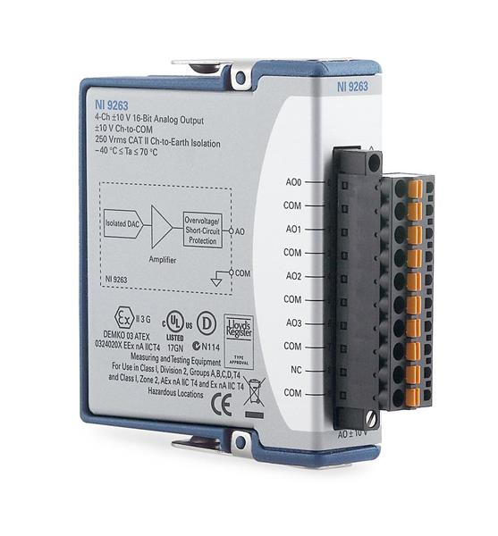
     &nbsp;&nbsp;&nbsp;
     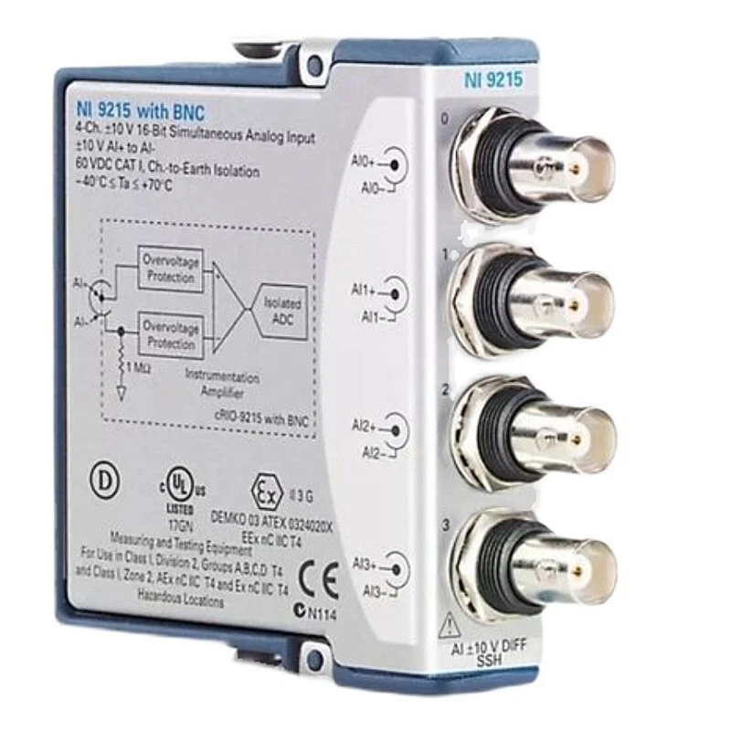
     <br><em>Figure (left) – NI 9263: 4-Ch, ±10 V, 16-bit Analog Output module (preferred for voltage command output to DBK-1024V). Figure (right) – NI 9215: 4-Ch, ±10 V, 16-bit Simultaneous Analog Input module with BNC connectors.</em>
   </p>

   - **NI 9263** (preferred): 4-channel, ±10 V, 16-bit **Analog Output** module. Can be programmed in LabVIEW to output a precise DC voltage to the DBK-1024V excitation input, directly replacing the manual resistor. The output voltage is software-controlled and can be logged alongside measurement data for full traceability of loading conditions.
   - **NI 9215**: 4-channel, ±10 V, 16-bit Simultaneous **Analog Input** module. While primarily an input module, it could be used in parallel to monitor the actual excitation voltage delivered to the brake controller as a feedback signal.

   **Current connectivity bottleneck:**

   Both NI 9263 and NI 9215 are C-Series modules that require a compatible chassis or controller to interface with a PC. Currently, the lab has only **one RS232-to-USB converter**, which is already in use for the existing DAQ setup. A second PC-to-controller interface is required to add these modules to the system.

   One candidate for resolving this is the **NI cRIO-9004** — a CompactRIO Real-Time Controller available in the lab — which can host C-Series modules (NI 9263/9215) and connect to the PC via Ethernet:

   <p align="center">
     
     <br><em>Figure – NI cRIO-9004 CompactRIO Real-Time Controller. Features: 4-slot C-Series module chassis, Ethernet (10/100) and RS-232 connectivity, 11–30 V DC power input, onboard FPGA. Can host the NI 9263 AO module to provide software-controlled brake excitation voltage.</em>
   </p>

   However, the **NI cRIO-9004 is currently non-operational** for this purpose: although the hardware itself still functions, the PC cannot detect the device (the cRIO-9004 does not appear in NI Measurement & Automation Explorer). This is likely due to the age of the controller (the cRIO-9004 was discontinued and runs an older real-time OS that may be incompatible with current NI-DAQmx and LabVIEW driver versions). Resolving this connectivity issue — either by configuring a compatible NI-RIO driver version or by procuring an additional USB/Ethernet-based cDAQ chassis (e.g., NI cDAQ-9174) — is a prerequisite before the NI 9263 can be brought online for brake automation.

3. **Perform shaft alignment and sensor calibration:**
   - Conduct a precision laser shaft alignment check on all coupled components (motor shaft → belt drive → gearbox input → gearbox output → torque sensor → brake), adjusting coupling positions until residual misalignment is within manufacturer tolerances.
   - Perform a zero-load calibration and sensitivity verification of the torque sensor before each measurement session.
   - Verify accelerometer mounting integrity and measure the frequency response function (FRF) of the bearing housing in the accelerometer mounting direction to characterize the transmission path.

4. **Systematic multi-condition dataset acquisition:**
   Once hardware synchronization and load automation are in place, execute a planned test matrix covering:
   - All 4 gear test sets (healthy + 3 fault types/severities in Set 2, 3 fault severities in Set 3, chipped + missing in Set 4)
   - 5 speed levels (10, 20, 30, 40, 50 Hz inverter frequency)
   - 3–5 load levels (selected from the brake's adjustable range)
   - Multiple repetitions per condition for statistical significance
   Total planned experimental conditions: 4 sets × 5 speeds × ≥3 loads × ≥3 repetitions = **≥180 acquisition sessions**.

5. **Spectral analysis and fault classification:**
   Apply signal processing algorithms to the collected dataset:
   - FFT-based frequency domain analysis: identify GMF harmonics and sidebands.
   - Envelope analysis (Hilbert transform): detect impulse-type faults (chipped/missing tooth, bearing defects).
   - Order Tracking (angular resampling using proximity sensor): analyze speed-normalized vibration spectra.
   - Time-Synchronous Averaging (TSA): separate gear-synchronous components from noise and asynchronous components.
   - Feature extraction and machine learning classification: train and evaluate classifiers (SVM, neural networks, CNNs) for automated fault detection and severity estimation.

---

## APPENDIX A: LABVIEW PROGRAM SCREENSHOTS

This appendix contains the complete LabVIEW VI block diagrams referenced in Section 3 of the report. These screenshots are provided for reference and reproducibility. The VI is implemented using the NI-DAQmx API with a Producer–Consumer architecture (Section 3.8) structured within a three-frame Flat Sequence (Section 3.7).

---

### Figure A1 — Block Diagram 1: Task Initialization Frame

<p align="center">
  
  <br><em>Figure A1 – LabVIEW Block Diagram 1: Initialization frame of the Flat Sequence. Three parallel DAQmx task configuration chains are visible: (top) Dev1 AI task for NI USB-9234 (accelerometer channels ai0:2 + proximity channel ai3); (center) Dev3 AI task for NI USB-6210 (torque channel ai0); (bottom) Dev3 Counter task (encoder ctr0) with DAQmx Timing set to external clock source /Dev3/ai/SampleClock and DAQmx Trigger (ArmStart) configured with source /Dev3/ai/StartTrigger. The left panel shows the Arm Start trigger configuration cluster (TrigType, DigEdge.Src, DigEdge.Edge). All three DAQmx Start Task VIs execute within this same frame for software synchronization.</em>
</p>

---

### Figure A2 — Block Diagram 2: Acquisition Execution Frame

<p align="center">
  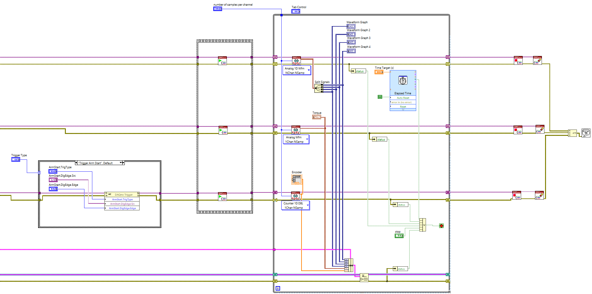
  <br><em>Figure A2 – LabVIEW Block Diagram 2: Execution frame containing the Producer loop (center gray box) and Consumer loop (lower section). The Producer loop calls three DAQmx Read VIs (Analog 1D Wfm NChan NSamp for Dev1 AI, Analog Wfm 1Chan NSamp for Dev3 AI, and Counter 1D DBL 1Chan NSamp for Dev3 Counter), passes results through Split Signals, updates the front-panel Waveform Graphs (Tab Control), and calls Enqueue Element. The Elapsed Time VI (upper right, with Time Target input) controls the loop stop condition. The Consumer loop is connected to the Producer via the Queue (blue wire). A DAQmx Trigger sub-VI (lower left) handles the Arm Start configuration.</em>
</p>

---

### Figure A3 — Block Diagram 3: Consumer Loop Detail

<p align="center">
  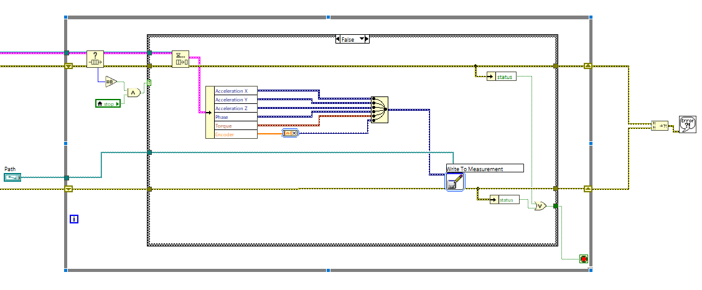
  <br><em>Figure A3 – LabVIEW Block Diagram 3: Consumer loop detail. The Dequeue Element VI retrieves the 6-channel data cluster from the queue. A Bundle VI assembles the channels (Acceleration X, Acceleration Y, Acceleration Z, Phase, Torque, Encoder) by name. The Write To Measurement VI writes the bundled data to the TDMS file at the path specified by the "Directory to Save Logs" front panel control. The loop stops when the Producer enqueues an empty sentinel cluster, which is detected and used to set the loop stop condition (bottom-left logic).</em>
</p>

---

## APPENDIX B: EQUIPMENT DATASHEETS AND REFERENCES

This appendix lists the official datasheets, user manuals, and technical specifications documents for all major hardware components used in the test rig. Cross-references to the relevant sections of this report are provided for each item.

| # | Component | Model | Report Section | Document / Link |
|:---:|:---|:---:|:---:|:---|
| B1 | **Electric Motor** | GR-5IK90A-S | Sec. 1.1a | [GIN RE Motor Catalog (Starline PDF)](https://docs.starline.vn/catalog/oriental-motor-k.pdf) |
| B2 | **Variable Frequency Drive** | YASKAWA V1000 (CIMR-VU) | Sec. 1.1b | [YASKAWA V1000 Technical Manual SIEPC71060618](https://www.yaskawa.com/delegate/getAttachment?documentId=SIEPC71060618&cmd=documents&openNewTab=true&documentName=SIEPC71060618.pdf) |
| B3 | **Synchronous Belt Drive** | Gates 339-GT3 + Pulleys | Sec. 1.2a | [MISUMI Timing Belt Catalog (Digital)](https://tw.c.misumi-ec.com/book/UNT1_M01_SS/digitalcatalog.html?page_num=01-50) |
| B4 | **Brake Controller Board** | Ji-Xiang DBK-1024V | Sec. 1.3b | [DBK-1024V Product Sheet (Ji-Xiang PDF)](https://www.ji-xiang.com/pub/archive/product/33264122996130676819/f_29189105.pdf) |
| B5 | **Triaxial IEPE Accelerometer** | PCB Piezotronics 356A32/NC | Sec. 2.1 | [PCB 356A32/NC Product Page](https://www.pcb.com/products?m=356a32_nc) |
| B6 | **Eddy-Current Proximity Transducer System** | Bently Nevada 3300 XL NSv | Sec. 2.2 | [3300 XL NSv Proximity Transducer System Datasheet (Baker Hughes PDF)](https://dam.bakerhughes.com/m/7a79b853504f738/original/3300-XL-NSv-Proximity-Transducer-System-Datasheet-147385-pdf.pdf) |
| B7 | **Rotary Torque Sensor** | JIHSENSE RT-2.5 Nm | Sec. 2.4a | [RT Series Torque Sensor Datasheet (JIHSENSE PDF)](https://jihsense-loadcell.com/pdf/rt.pdf) |
| B8 | **Torque Amplifier** | JIHSENSE JS-100 | Sec. 2.4b | [JIHSENSE Product Catalog 2025, p. 39 (PDF)](https://jihsense-loadcell.com/pdf/2025.pdf) |
| B9 | **DAQ Module — Vibration/IEPE** | NI USB-9234 | Sec. 2.5a | [NI USB-9234 Specifications (NI Docs)](https://www.ni.com/docs/en-US/bundle/ni-9234-specs/page/specs.html) |
| B10 | **DAQ Module — Torque/Encoder** | NI USB-6210 | Sec. 2.5b | [NI USB-6210 Specifications (NI Docs)](https://www.ni.com/docs/en-US/bundle/usb-6210-specs/page/specs.html) |

---

### B1. Electric Motor — GR-5IK90A-S

**Referenced in:** Section 1.1a

| Parameter | Value |
|:---|:---|
| Manufacturer | GIN RE ELECTRIC MOTOR |
| Model | GR-5IK90A-S |
| Rated Power | 90 W |
| Rated Voltage | 220 V / 3-phase |
| Rated Current | 0.55 A |
| Rated Torque | 5.5 kg·cm (≈ 0.54 N·m) |
| Poles | 4-pole (2 pole pairs) |
| Synchronous Speed @ 50 Hz | 1500 rpm (theoretical) |
| Frame | IK90 |
| Datasheet | [Starline Oriental Motor Catalog](https://docs.starline.vn/catalog/oriental-motor-k.pdf) |

---

### B2. Variable Frequency Drive — YASKAWA V1000

**Referenced in:** Section 1.1b

| Parameter | Value |
|:---|:---|
| Manufacturer | Yaskawa Electric Corporation |
| Series | V1000 / CIMR-VU |
| Input | Single-phase 200–240 VAC, 50/60 Hz |
| Output | 3-phase 200–240 VAC, 0.01–400 Hz |
| Control Method | V/f, Open-Loop Vector (OLV), PM OLV |
| Overload Rating | 150% for 60 s (Heavy Duty) |
| Communication | RS-485 Memobus/Modbus RTU |
| Operating Temperature | −10°C to +50°C |
| Manual | [SIEPC71060618 Technical Manual](https://www.yaskawa.com/delegate/getAttachment?documentId=SIEPC71060618&cmd=documents&openNewTab=true&documentName=SIEPC71060618.pdf) |

---

### B3. Synchronous Belt Drive — Gates 339-GT3

**Referenced in:** Section 1.2a

| Parameter | Value |
|:---|:---|
| Belt Model | Gates PowerGrip 339-GT3 |
| Belt Type | Synchronous (timing) belt |
| Circumference | 339 mm |
| Tooth Pitch | 3 mm (GT3) |
| Number of Teeth | 113 |
| Driver Pulley | 18 teeth (on motor shaft) |
| Driven Pulley | 18 teeth (on gearbox input) |
| Speed Ratio (Belt) | 1:1 |
| Catalog | [MISUMI Timing Belt Digital Catalog](https://tw.c.misumi-ec.com/book/UNT1_M01_SS/digitalcatalog.html?page_num=01-50) |

---

### B4. Brake Controller Board — Ji-Xiang DBK-1024V

**Referenced in:** Sections 1.3b, 4.2 (Issue 3), 4.3 (Future Work #2)

| Parameter | Value |
|:---|:---|
| Manufacturer | Ji-Xiang (JI-XIANG) |
| Model | DBK-1024V |
| Function | Magnetic powder brake excitation controller |
| Control Input | Analog voltage (currently via rotary potentiometer; future: NI 9263 AO) |
| Output | DC excitation voltage to magnetic powder brake |
| Product Sheet | [DBK-1024V PDF (Ji-Xiang)](https://www.ji-xiang.com/pub/archive/product/33264122996130676819/f_29189105.pdf) |

---

### B5. Triaxial IEPE Accelerometer — PCB 356A32/NC

**Referenced in:** Sections 2.1, 2.5a

| Parameter | Value |
|:---|:---|
| Manufacturer | PCB Piezotronics (MTS Systems) |
| Model | 356A32/NC |
| Type | Triaxial, mini (5 g), ICP® (IEPE) |
| Sensitivity | 100 mV/g (all three axes) |
| Frequency Range | 1 Hz to 4,000 Hz (±3 dB) |
| Measurement Range | ±50 g pk |
| Housing | Titanium |
| Connector | 4-pin MIL-spec (no cable included) |
| Power Requirement | 18–30 VDC, 2–20 mA (ICP constant current source, provided by NI USB-9234) |
| Product Page | [PCB 356A32/NC](https://www.pcb.com/products?m=356a32_nc) |

---

### B6. Proximity Transducer System — Bently Nevada 3300 XL NSv

**Referenced in:** Sections 2.2, 2.5a

| Parameter | Value |
|:---|:---|
| Manufacturer | Bently Nevada (Baker Hughes) |
| System | 3300 XL NSv Proximity Transducer System |
| Components | Probe + Extension Cable + Proximitor® Signal Conditioner |
| Measurement | Non-contacting eddy-current displacement (shaft vibration and position) |
| Output | −24 VDC nominal; −4 mV/μm (≈ −100 mV/mil) sensitivity |
| Measuring Range | 0.25 mm to 2.26 mm (linear range) |
| Frequency Response | DC to 10,000 Hz |
| Supply Voltage | −24 VDC (provided by RK4 Proximitor unit) |
| Datasheet | [3300 XL NSv Datasheet (Baker Hughes)](https://dam.bakerhughes.com/m/7a79b853504f738/original/3300-XL-NSv-Proximity-Transducer-System-Datasheet-147385-pdf.pdf) |

---

### B7. Rotary Torque Sensor — JIHSENSE RT-2.5 Nm

**Referenced in:** Sections 2.4a, 4.2 (Issue 5)

| Parameter | Value |
|:---|:---|
| Manufacturer | JIHSENSE |
| Model | RT Series, 2.5 N·m capacity |
| Type | Rotary torque sensor with slip ring signal transmission |
| Rated Capacity | 2.5 N·m |
| Rated Output | 2 mV/V (bridge excitation) |
| Rated Excitation | 5–10 VDC |
| Maximum Speed | **200 rpm** (critical limit — see Section 4.2 Issue 5) |
| Operating Temperature | −10°C to +60°C |
| Datasheet | [JIHSENSE RT Series (PDF)](https://jihsense-loadcell.com/pdf/rt.pdf) |

---

### B8. Torque Signal Amplifier — JIHSENSE JS-100

**Referenced in:** Section 2.4b

| Parameter | Value |
|:---|:---|
| Manufacturer | JIHSENSE |
| Model | JS-100 |
| Function | Bridge excitation + signal amplifier for strain gauge torque sensors |
| Excitation Voltage | 5 VDC (to sensor bridge) |
| Output Signal | ±5 VDC (analog voltage, amplified and linearized) |
| Display | 4-digit LED display (torque value in N·m or kg·cm) |
| Output Connector | BNC (analog voltage output to DAQ) |
| Catalog | [JIHSENSE Product Catalog 2025, p. 39](https://jihsense-loadcell.com/pdf/2025.pdf) |

---

### B9. DAQ Module — NI USB-9234

**Referenced in:** Sections 2.5a, 3.1–3.8, 4.2 (Issue 4)

| Parameter | Value |
|:---|:---|
| Manufacturer | National Instruments (NI) |
| Model | NI USB-9234 |
| ADC Architecture | Delta-Sigma (DSA), simultaneous sampling, with digital anti-aliasing filter |
| Analog Input Channels | 4 channels (AI0–AI3) |
| Resolution | 24-bit |
| Maximum Sample Rate | 51,200 S/s per channel (simultaneous) |
| Sample Rate Used | **25,600 S/s** (this experiment) |
| Input Range | ±5 V |
| IEPE Excitation | Built-in 2 mA constant-current source per channel (switchable) |
| AC/DC Coupling | Switchable per channel |
| Anti-Aliasing Filter | Integrated digital filter with Sinc³ response; group delay depends on sample rate |
| Interface | USB 2.0 (Full-Speed) |
| Isolation | 60 V channel-to-channel and channel-to-earth |
| OS Compatibility | Windows, NI-DAQmx driver required |
| Specifications | [NI USB-9234 Specifications (NI Docs)](https://www.ni.com/docs/en-US/bundle/ni-9234-specs/page/specs.html) |

---

### B10. DAQ Module — NI USB-6210

**Referenced in:** Sections 2.5b, 3.1–3.8, 4.2 (Issue 4)

| Parameter | Value |
|:---|:---|
| Manufacturer | National Instruments (NI) |
| Model | NI USB-6210 |
| ADC Architecture | SAR (Successive Approximation Register), multiplexed (non-simultaneous) |
| Analog Input Channels | 16 single-ended / 8 differential |
| Resolution | 16-bit |
| Maximum Aggregate Sample Rate | 250,000 S/s (multiplexed across all AI channels) |
| Input Range | ±10 V (software-selectable: ±0.1, ±0.5, ±1, ±5, ±10 V) |
| Digital I/O | 4 DI + 4 DO (5 V TTL/CMOS) |
| Counter/Timer | 2 × 32-bit hardware counters (used for quadrature encoder decoding) |
| Counter Clock | **No dedicated counter sample clock** — external clock required (see Section 3.5) |
| PFI Lines | 4 PFI terminals (PFI0–PFI3) for routing digital signals |
| Interface | USB 2.0 (Full-Speed) |
| OS Compatibility | Windows, NI-DAQmx driver required |
| Specifications | [NI USB-6210 Specifications (NI Docs)](https://www.ni.com/docs/en-US/bundle/usb-6210-specs/page/specs.html) |
