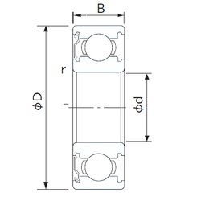
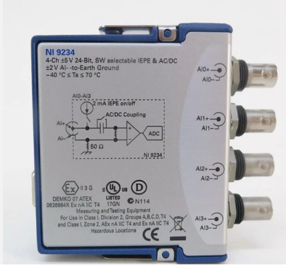
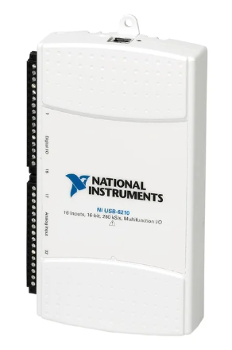

# EXPERIMENTAL MEASUREMENT REPORT: GEAR DRIVE SYSTEM

> [!IMPORTANT]
> **Experiment Objective:**
> To simultaneously collect multi-channel data from multiple sensor types (acceleration, proximity, torque, speed) for the diagnosis and condition monitoring of gear faults under various operating conditions (speed, load, fault type, gear material).

---

## PART 1: DRIVE SYSTEM

### 1.1. Prime Mover

#### a. Electric Motor — GIN RE ELECTRIC MOTOR GR-5IK90A-S

| Parameter | Value |
|:---|:---|
| **Manufacturer** | GIN RE ELECTRIC MOTOR |
| **Model** | GR-5IK90A-S |
| **Rated Power** | 90 W |
| **Rated Current** | 0.55 A |
| **Rated Torque** | 5.5 kg·cm (≈ 0.54 N·m) |
| **Voltage** | 220 V / 3-phase |
| **Number of Pole Pairs ($p$)** | 2 pole pairs (4 poles) |
| **Maximum Speed** | 1750 rpm |

The motor speed is controlled via the YASKAWA V1000 inverter. With $p = 2$ pole pairs, the synchronous shaft speed corresponding to the inverter output frequency is given by:

\[ n = \frac{60 \times f}{p} \]

**Motor shaft speed at each preset frequency:**

| Inverter Frequency ($f$) | Synchronous Speed ($n$) |
|:---:|:---:|
| 10 Hz | 300 rpm |
| 20 Hz | 600 rpm |
| 30 Hz | 900 rpm |
| 40 Hz | 1200 rpm |
| 50 Hz | 1500 rpm |

> [!NOTE]
> The actual shaft speed will be slightly lower than the synchronous speed due to slip in the induction motor (typically 3–5%). The actual speed must be measured directly by the encoder mounted on the motor shaft to ensure accuracy in signal analysis.

---

#### b. Variable Frequency Drive — YASKAWA V1000 (CIMR-VU Series)

*Front panel of the control box featuring the Yaskawa V1000 inverter and DCbox displays.*

**Key Technical Specifications:**

| Parameter | Value |
|:---|:---|
| **Manufacturer** | Yaskawa Electric Corporation |
| **Product Line** | V1000 / CIMR-VU Series (CIMR-VUBA — Single-Phase 200V) |
| **Input Voltage** | Single-phase 200–240 VAC (+10%, -15%), 50/60 Hz (±5%) |
| **Output Voltage** | 3-phase 200–240 VAC (proportional to input voltage) |
| **Output Frequency**| 0.01 – 400 Hz |
| **Control Method** | Open-Loop Current Vector (OLV); V/f; PM OLV |
| **Overload Capacity** | Heavy Duty: **150%** for 60 s; Normal Duty: **120%** for 60 s |

**Control Panel and Power-Up Procedure:**
1. **Power ON:** Push the NFB (No-Fuse Breaker) on the control panel to the ON position.
2. **Set Frequency:** Press the `LO/RE` key to switch to Local control mode. Use the arrow keys to adjust the frequency. Press `ENTER`.
3. **Start Motor:** Press the `RUN` key.
4. **Stop Motor:** Press the `STOP` key.

---

### 1.2. Drive Train

#### a. Motor-to-Gearbox Coupling — Synchronous Belt Drive

| Parameter | Value |
|:---|:---|
| **Belt Model** | Gates PowerGrip **339-GT3** |
| **Belt Type** | Synchronous (Timing) Belt |
| **Material** | Synthetic rubber with fiberglass tension cords |
| **Pulley Ratio** | 34T : 34T (**1:1** Ratio) |

> [!TIP]
> **Why Synchronous Belts (GT3)?**
> Unlike traditional V-belts that suffer from 1–3% micro-slip, synchronous belts mesh positively, guaranteeing an exact 1:1 speed ratio. This exact rotational speed synchronization is critical for signal processing techniques like Order Tracking and Synchronous Time Averaging (STA). Additionally, the GT3 curvilinear profile distributes contact stress more uniformly than trapezoidal belts, preventing root tearing and reducing vibration.

---

#### b. Gear Drive System — 2-Stage Reduction Gearbox

*Detailed view of the 2-stage gear reduction assembly.*

**Drive Configuration:**
The gearbox uses a **2-stage series reduction** layout with 3 shafts and 4 gears.

\[ i_{total} = i_1 \times i_2 = \frac{Z_2}{Z_1} \times \frac{Z_4}{Z_3} = \frac{50}{25} \times \frac{50}{25} = 2 \times 2 = \mathbf{4:1} \]

**Output shaft speed:** $n_{out} = \frac{n_{motor}}{4}$

**Gear Specifications & Material:**
The gears are predominantly made of **S45C Steel**, a medium carbon structural steel ($0.42–0.48\%\text{ C}$).
* **Density:** $7850 \text{ kg/m}^3$
* **Elastic Modulus:** $205 \text{ GPa}$
* **Tensile Strength:** $570 - 700 \text{ MPa}$
* **Hardness:** Teeth can be induction hardened to $50 - 58 \text{ HRC}$ to resist wear while maintaining a tough core to absorb shock loads and resist tooth root bending fatigue.

| Parameter | Small Gears (Z₁, Z₃) | Large Gears (Z₂, Z₄) |
|:---|:---:|:---:|
| **Type** | Spur Gear | Spur Gear |
| **Number of Teeth ($Z$)** | 25 | 50 |
| **Module ($m$)** | 2 | 2 |

**Gear Mesh Frequency (GMF):**
* **Stage 1:** $f_{GMF1} = 25 \times f_{motor}$
* **Stage 2:** $f_{GMF2} = 25 \times \frac{f_{motor}}{2}$

> [!NOTE]
> **Gear Fault Diagnosis Background**
> Monitoring gear health is vital for preventing unscheduled downtime. Faults manifest uniquely in the vibration spectrum:
> * **Tooth Root Crack:** Reduces meshing stiffness periodically, causing Amplitude/Phase Modulation. This appears as sidebands around the GMF spaced at the shaft rotational frequency ($f_{GMF} \pm n \cdot f_r$).
> * **Chipped Tooth:** Creates a sharper, localized transient impact, producing a broader range of sidebands and exciting high-frequency structural resonances.
> * **Missing Tooth:** Results in severe impacts once per revolution, manifesting as prominent impulse trains and elevated harmonics of shaft speed.

**Available Gear Test Sets:**

| Set | Description | Material |
|:---:|:---|:---|
| **Set 1** | 2 pairs (4 gears). **All healthy.** | Steel S45C (Electroless nickel plating) |
| **Set 2** | 3 small gears (25T) with **tooth root crack** faults (3 severity levels) | Steel S45C |
| **Set 3** | 3 small gears (25T) with **tooth root crack** faults (3 severity levels) | Aluminum (Al) |
| **Set 4** | 2 large gears (healthy); 2 small gears (**chipped tooth**, **missing tooth**) | Unknown |

---

#### c. Rolling Bearings — NACHI 6201ZE

**Bearing Parameters:**
* **Bore ($d$):** 12 mm | **Outer ($D$):** 32 mm | **Width ($B$):** 10 mm
* **Pitch Diameter ($D_m$):** 22.0 mm | **Ball Diameter ($d_b$):** 5.953 mm | **Balls ($Z$):** 7

> [!WARNING]
> **Characteristic Fault Frequencies**
> Based on the bearing geometry, specific defect frequencies can be calculated. For an input shaft speed of **1500 rpm (25 Hz)**:
> * **BPFO (Outer Race):** $63.82\text{ Hz}$
> * **BPFI (Inner Race):** $111.18\text{ Hz}$
> * **BSF (Ball Spin):** $42.81\text{ Hz}$
> * **FTF (Cage Speed):** $9.12\text{ Hz}$
>
> For an output shaft speed of **375 rpm (6.25 Hz)**:
> * **BPFO:** $15.96\text{ Hz}$
> * **BPFI:** $27.79\text{ Hz}$
> * **BSF:** $10.70\text{ Hz}$
> * **FTF:** $2.28\text{ Hz}$

---

### 1.3. Output Load — Magnetic Powder Brake

*Output shaft coupled to the torque sensor and magnetic powder brake.*

| Parameter | Value |
|:---|:---|
| **Load Device** | Magnetic Powder Brake |
| **Exciting Voltage** | 0 – 25 V (continuously adjustable via rotary resistor) |
| **Brake Controller** | Ji-Xiang (Mean Well RS-25-5 power supply) |

> [!TIP]
> **Operating Principle of Magnetic Powder Brake:**
> The brake contains an annular gap filled with fine magnetic iron alloy powder. When DC current is supplied to the stator coil, the magnetic flux magnetizes the iron particles, aligning them into rigid **magnetic powder chains** bridging the rotor and stator. The shear resistance of these chains generates a smooth braking torque.
> * **Linear Control:** In its linear region, braking torque is directly proportional to coil excitation current ($T \propto I$), offering precise load control.
> * **Speed Independence:** Torque depends purely on excitation current, not on slip speed, ensuring a steady load regardless of RPM.

---

## PART 2: MEASUREMENT SYSTEM

*Overview of the data acquisition wiring and layout.*

### 2.1. Sensors

#### a. Motor Encoder — Optical Incremental Encoder

**Purpose:** Measures instantaneous rotational speed and angular position of the motor shaft.
* **PPR:** 1024 pulses per revolution.
* **Output:** Quadrature square wave (Channels A and B). Read via NI USB-6210.
* **Resolution:** 4x decoding yields **4096 counts/revolution**.

#### b. Vibration Sensor — PCB Piezotronics 356A32/NC

**Purpose:** Measures triaxial acceleration (X, Y, Z) at the bearing housing.
* **Type:** IEPE (Integrated Electronics Piezo-Electric).
* **Sensitivity:** **100 mV/g** (10.2 mV/(m/s²)) ±10%.
* **Frequency Range:** 1.0 – 4,000 Hz (±5%).
* **Mounting:** Positioned on the housing closest to the faulty gear to capture high-energy transient signals.

#### c. Proximity Sensor — Bently Nevada 3300 XL NSv

*Bently Nevada RK4 Proximitor Assembly.*

**Purpose:** Measures shaft phase and tooth passing profile for Order Tracking.
* **Principle:** Eddy-current displacement measurement.
* **Scale Factor:** **7.87 V/mm (200 mV/mil)**.
* **Frequency Response:** 0 Hz – 10 kHz.

#### d. Torque Sensor — JIHSENSE RT-2.5 Nm

*JS-100 Load Cell Amplifier used to condition the torque sensor signal.*

**Purpose:** Measures the braking torque from the magnetic powder brake.
* **Range:** 0 – 2.5 N·m.
* **Principle:** Wheatstone bridge strain gauges bonded to a torsion shaft.
* **Amplification:** The raw mV/V signal is amplified and filtered by the JS-100 controller before being sampled by the NI USB-6210.

---

### 2.2. Data Acquisition Modules

#### a. NI USB-9234 (Dynamic Signal Acquisition)

Dedicated to sound and vibration measurements (IEPE accelerometer and Proximity sensor).
* **Channels:** 4 AI (Simultaneous).
* **Resolution:** 24-bit.
* **Max Sample Rate:** 51.2 kS/s per channel.
* **Features:** Built-in anti-aliasing filters and software-selectable 2mA IEPE excitation.

#### b. NI USB-6210 (Multifunction DAQ)

Used for general-purpose analog voltage (Torque) and digital counter inputs (Encoder).
* **Channels:** 16 AI (16-bit, 250 kS/s).
* **Counters:** 2 × 32-bit counters (for reading quadrature encoder signals).

---

## PART 3: LABVIEW PROGRAMMING ARCHITECTURE

**DAQmx API over DAQ Assistant:**
The DAQmx API is utilized instead of the DAQ Assistant to provide deep configuration capabilities, enabling hardware clock synchronization across the NI USB-9234 and USB-6210 modules, and allowing precise configuration of IEPE channels and counter decoders.

**Producer–Consumer Loop:**
To prevent buffer overflows and dropped samples at high sample rates (e.g., 51.2 kS/s), the software uses a Producer-Consumer architecture:
* **Producer Loop:** Continuously reads hardware buffers at high speed and pushes data to a Queue.
* **Consumer Loop:** Dequeues the data independently and writes to the measurement file (TDMS/CSV) or updates the UI.

---

## PART 4: LIMITATIONS & FUTURE WORK

### 4.1. Current Challenges
1. **Manual Brake Control:** Load is currently adjusted via a manual rotary resistor, which lacks precision and repeatability for systematic design of experiments.
2. **Synchronization Issues:** The two DAQ devices (9234 and 6210) are not perfectly time-synchronized at the hardware clock level.
3. **Alignment:** Test rig geometric alignment and bearing preloads remain unverified.

### 4.2. Future Work
* **Automated Load Control:** Replace the manual resistor with a Digital-to-Analog (DAC) or PWM controller to programmatically step through varying load profiles via software.
* **Hardware Synchronization:** Implement a shared PFI trigger or sample clock routing between the two NI modules to guarantee sample-accurate time alignment.
* **Systematic Fault Analysis:** Execute a complete matrix of experiments across speeds (10–50 Hz), loads, and defect severity levels, applying envelope analysis and synchronous time averaging to extract defect signatures.
