# Operation Manual: Bearing Diagnosis Vibration Platform

This document is the English translation of the **Bearing Diagnosis Vibration Platform Operation Manual** (originally by Cenming Co., Ltd.) and the associated delivery slips from the manufacturer **Yuexu Co., Ltd.**. All images have been cropped to display only the diagrams and equipment photos, removing the original Chinese text.

> [!NOTE]
> **Document Integrity Notice:**
> - **Page 12** is missing from the provided set of source images. Page 12 likely contains the start of "Chapter 2: Control Box Operation", specifically sections 1 and 2.
> - Potential typos and inconsistencies in the original Traditional Chinese text have been resolved and annotated with **[Translator's Notes]** to ensure technical accuracy.

---

## Table of Contents
1. [Cover Page](#cover-page)
2. [Chapter 1: Hardware Introduction](#chapter-1-hardware-introduction)
   - [1. Front Panel Description (Page 1)](#1-front-panel-description-page-1)
   - [2. Rear Panel Description (Page 2)](#2-rear-panel-description-page-2)
   - [3. Platform Description (Page 3)](#3-platform-description-page-3)
3. [Mode A: Motor Direct-Coupled Inertia Disc Module](#mode-a-motor-direct-coupled-inertia-disc-module)
   - [1-1-1 Prime Mover Module Description (Page 4)](#1-1-1-prime-mover-module-description-page-4)
   - [1-1-2 Transmission Module Description (Page 5)](#1-1-2-transmission-module-description-page-5)
   - [1-1-3 Inertia Disc Module Description (Page 6)](#1-1-3-inertia-disc-module-description-page-6)
4. [Mode B: Motor Belt-Driven Transmission and Inertia Disc Module](#mode-b-motor-belt-driven-transmission-and-inertia-disc-module)
   - [1-2 Mode B Platform Overview (Page 7)](#1-2-mode-b-platform-overview-page-7)
   - [1-2-1 Prime Mover Module Description (Page 8)](#1-2-1-prime-mover-module-description-page-8)
   - [1-2-2 Transmission Module Description (Page 9)](#1-2-2-transmission-module-description-page-9)
   - [B-3 Pulley Assembly (Page 10)](#b-3-pulley-assembly-page-10)
   - [1-2-3 Inertia Disc Module Description (Page 11)](#1-2-3-inertia-disc-module-description-page-11)
5. [Chapter 2: Control Box Operation](#chapter-2-control-box-operation)
   - [Page 12 (MISSING)](#page-12-missing)
   - [3. Running the Inverter & 4. Frequency Adjustment (Page 13)](#3-running-the-inverter--4-frequency-adjustment-page-13)
   - [5. Adjusting Frequency to 20Hz & 6. Saving Settings (Page 14)](#5-adjusting-frequency-to-20hz--6-saving-settings-page-14)
   - [7. Starting the Induction Motor & 8. Speedmeter Display (Page 15)](#7-starting-the-induction-motor--8-speedmeter-display-page-15)
   - [9. Stopping the Induction Motor (Page 16)](#9-stopping-the-induction-motor-page-16)
6. [Appendix: Manufacturer Delivery Slips](#appendix-manufacturer-delivery-slips)
   - [Delivery Slip Page 1 (Transaction Details)](#delivery-slip-page-1-transaction-details)
   - [Delivery Slip Page 2 (Equipment Specifications Table)](#delivery-slip-page-2-equipment-specifications-table)

---

## Cover Page
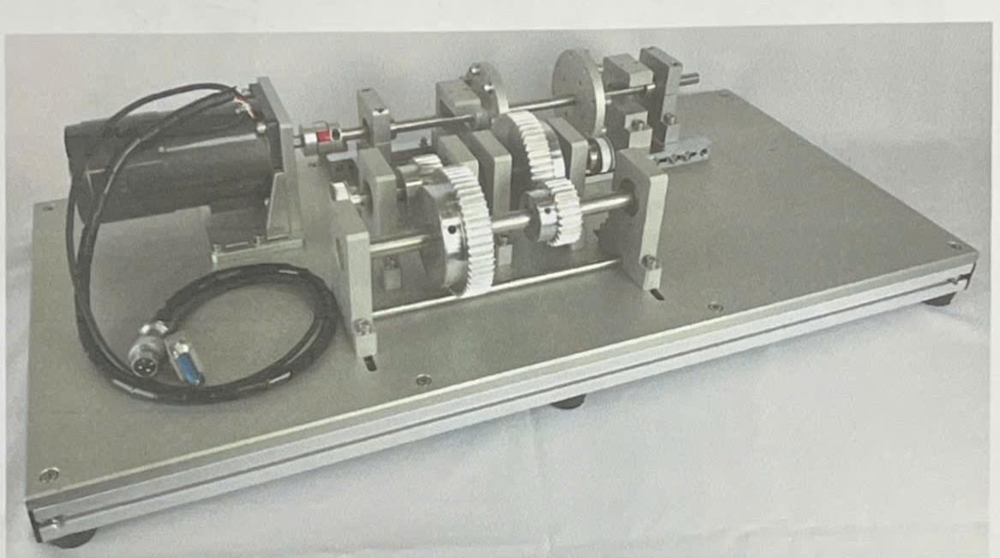

```text
Bearing Diagnosis Vibration Platform
Operation Manual

Cenming Co., Ltd.
Address: 7F, No. 926, Zhongzheng Rd., Zhonghe Dist., New Taipei City
TEL: (02) 2223-2015
FAX: (02) 2222-3619
```

---

## Chapter 1: Hardware Introduction

### 1. Front Panel Description (Page 1)
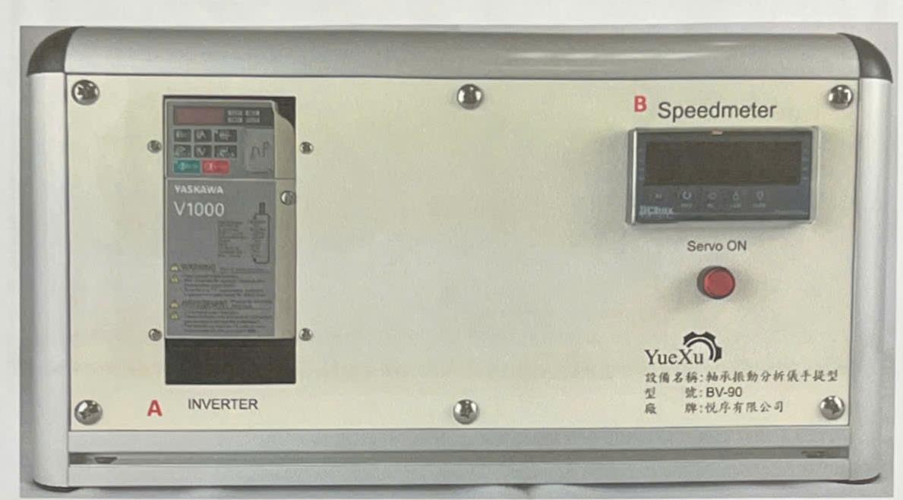

```text
Chapter 1: Hardware Introduction

1. Front Panel Description
[Figure 1-1 Front Panel Configuration Layout]
- Label A: INVERTER
- Label B: Speedmeter
- Label: Servo ON [Red Button]

Device Name: Portable Bearing Vibration Analyzer
Model: BV-90
Manufacturer: Yuexu Co., Ltd.

A. INVERTER (Frequency Inverter)
   Controls the induction motor.
B. Speedmeter (Tachometer Display)
   Displays the rotation speed of the induction motor (in rpm).
```

---

### 2. Rear Panel Description (Page 2)
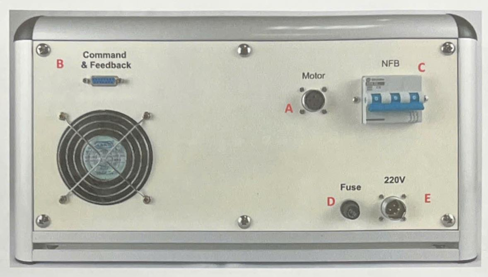

```text
2. Rear Panel Description
[Figure 1-2 Rear Panel Configuration Layout]
- Label B: Command & Feedback
- Label A: Motor
- Label C: NFB [No-Fuse Breaker]
- Label D: Fuse
- Label E: 220V

A. Motor
   Connects to the platform's induction motor cable A-1.
B. Command & Feedback
   Connects to the platform's induction motor encoder/feedback cable A-2.
C. NFB (No-Fuse Breaker / Miniature Circuit Breaker)
   Main power switch for the device.
   Switch UP to turn ON the power.
D. Fuse
   Fuse holder containing a 20mm 2A 250V fuse.
E. 220V
   Connect via power cable to utility three-phase 220V power supply.
   [Translator's Note: The actual inverter unit rated input is single-phase 220V, but utility connection is noted as three-phase 220V in the source manual.]
```

---

### 3. Platform Description (Page 3)
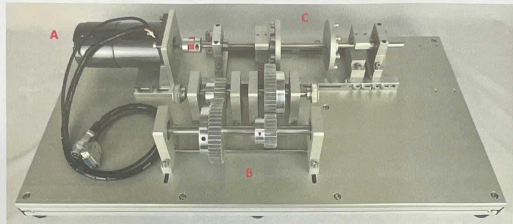

```text
3. Platform Description

1-1 Mode A: Motor Direct-Coupled Inertia Disc Module
[Figure 1-3 Mode A Platform Appearance]
- Label A: Prime Mover Module
- Label B: Transmission Module
- Label C: Inertia Disc Module

A. Prime Mover Module
   1. Induction Motor
   2. Power: 90W
   3. Encoder: 1024 PPR (Pulses Per Revolution)
   4. Speed: 1750 RPM
B. Transmission Module
C. Inertia Disc Module
```

---

## Mode A: Motor Direct-Coupled Inertia Disc Module

### 1-1-1 Prime Mover Module Description (Page 4)
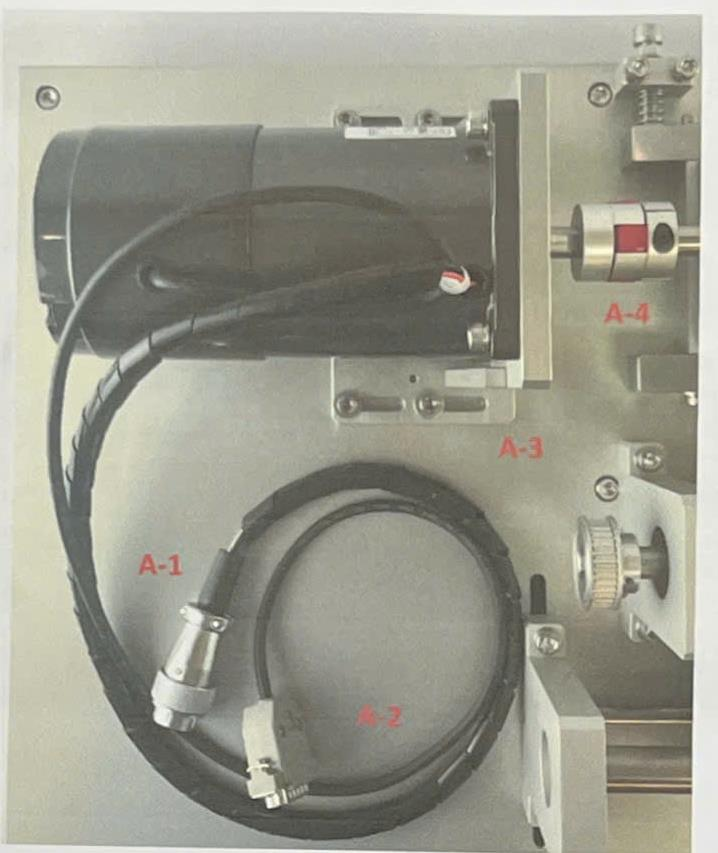

```text
1-1-1 Prime Mover Module Description
[Figure 1-4 Prime Mover Module Appearance]
- Labels A-1, A-2, A-3, A-4

A-1 Induction motor power connector
A-2 Induction motor encoder connector
A-3 Induction motor mounting/fixing fixture
A-4 Jaw-type flexible coupling
```

---

### 1-1-2 Transmission Module Description (Page 5)
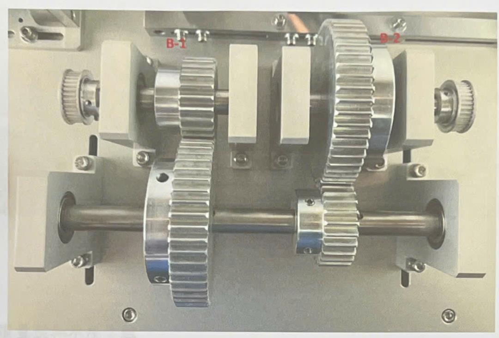

```text
1-1-2 Transmission Module Description
[Figure 1-5 Transmission Module Appearance]
- Labels B-1, B-2

B-1 Motor-Side Gear Transmission Assembly
    B-1-1 Gear Type: Spur Gear
    B-1-2 Number of Teeth: 25T
    B-1-3 Gear Module: 2
    B-1-4 Pressure Angle: 20 degrees
    B-1-5 Tip Diameter (Outer Diameter): 54mm
B-2 Inertia Disc Gear Transmission Assembly
    B-2-1 Gear Type: Spur Gear
    B-2-2 Number of Teeth: 50T
    B-2-3 Gear Module: 2
    B-2-4 Pressure Angle: 20 degrees
    B-2-5 Tip Diameter (Outer Diameter): 104mm
```

---

### 1-1-3 Inertia Disc Module Description (Page 6)
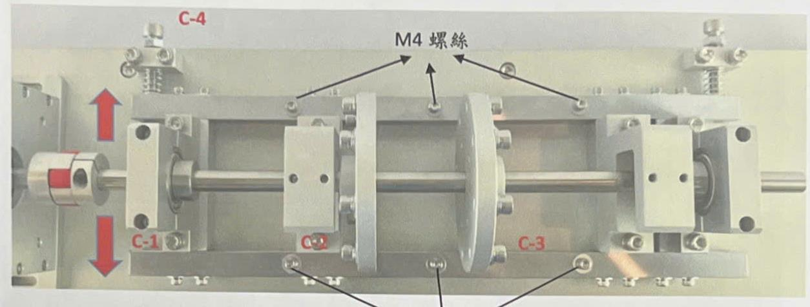

```text
1-1-3 Inertia Disc Module Description
[Figure 1-6 Inertia Disc Module Appearance]
- Labels C-1, C-2, C-3, C-4, M4 Screws

C-1 Inertia Disc Bearing Housing (2 sets)
    C-1-1 Bearing Inner Diameter (ID): 20mm
    C-1-2 Bearing Outer Diameter (OD): 37mm
    C-1-3 Bearing Thickness: 9mm
    [Translator's Note: The original text reads "後度" (rear-degree), which is a typo for "厚度" (thickness).]
C-2 Displacement Sensor Mounting Bracket (2 sets)
C-3 Inertia Disc (2 sets)
    C-3-1 Inertia Disc Weight: 202g
    C-3-2 Screw / Inertia Weight Bead: 7.1g
    C-3-3 Total Weight: 202 + (7.1 * 8) = 258.8g
C-4 Inertia Disc Module Adjustment Screws
    C-4-1 Adjustable offset between the inertia disc module and the motor shaft center.
    C-4-2 Displacement range: ±1.5mm
    C-4-3 When adjusting the offset, first loosen the 6 M4 screws on the module before proceeding.
    C-4-4 Turning the screw clockwise shifts the module upward on the drawing.
    C-4-5 Turning the screw clockwise shifts the module downward on the drawing.
    [Translator's Note: The original text lists "clockwise" (順時針) for both upward (C-4-4) and downward (C-4-5) offset adjustments. This is likely a typographical error in the source document, where one direction should be counter-clockwise, or it refers to adjusting different physical screws on the top and bottom.]
```

---

## Mode B: Motor Belt-Driven Transmission and Inertia Disc Module

### 1-2 Mode B Platform Overview (Page 7)
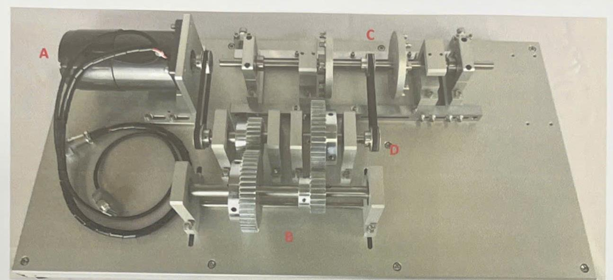

```text
1-2 Mode B: Motor Belt-Driven Transmission and Inertia Disc Module
[Figure 1-7 Mode B Platform Appearance]
- Labels A: Prime Mover Module, B: Transmission Module, C: Inertia Disc Module, D: Belt Drive Assembly

A. Prime Mover Module
   1. Induction Motor
   2. Power: 90W
   3. Encoder: 1024 PPR
   4. Speed: 1750 RPM
B. Transmission Module
C. Inertia Disc Module
D. Belt Drive Assembly
```

---

### 1-2-1 Prime Mover Module Description (Page 8)
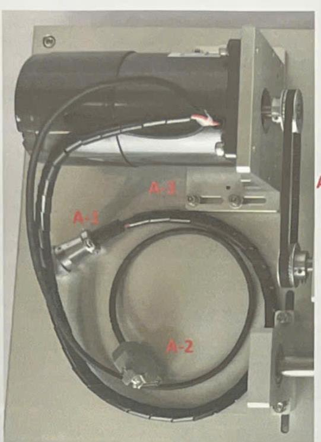

```text
1-2-1 Prime Mover Module Description
[Figure 1-8 Prime Mover Module Appearance]
- Labels A-1, A-2, A-3, A-4

A-1 Induction motor power connector
A-2 Induction motor encoder connector
A-3 Induction motor mounting/fixing fixture
A-4 Pulley Assembly
    A-4-1 Motor-side pulley
    A-4-2 Gear-side pulley (Note: couples to the transmission shaft pulley)
    A-4-3 Pulley Tooth Count: 34T
    A-4-4 Belt Width: 6mm
    A-4-5 Belt Center-to-Center Distance: 119mm
```

---

### 1-2-2 Transmission Module Description (Page 9)
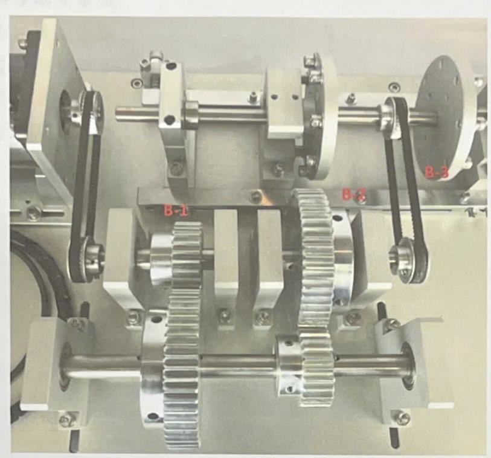

```text
1-2-2 Transmission Module Description
[Figure 1-9 Transmission Module Appearance]
- Labels B-1: Motor Gear Assembly, B-2: Inertia Disc Gear Assembly, B-3: Belt pulley on transmission shaft

B-1 Motor Gear Drive Assembly
    B-1-1 Gear Type: Spur Gear
    B-1-2 Number of Teeth: 25T
    B-1-3 Gear Module: 2
    B-1-4 Pressure Angle: 20 degrees
    B-1-5 Tip Diameter (Outer Diameter): 54mm
B-2 Inertia Disc Gear Drive Assembly
    B-2-1 Gear Type: Spur Gear
    B-2-2 Number of Teeth: 50T
    B-2-3 Gear Module: 2
    B-2-4 Pressure Angle: 20 degrees
    B-2-5 Tip Diameter (Outer Diameter): 104mm
```

---

### B-3 Pulley Assembly (Page 10)

```text
B-3 Pulley Assembly
    B-3-1 Motor-side pulley
    B-3-2 Gear-side pulley (pulley on transmission shaft)
    B-3-3 Pulley Tooth Count: 34T
    B-3-4 Belt Width: 6mm
    B-3-5 Belt Center-to-Center Distance: 119mm
```

---

### 1-2-3 Inertia Disc Module Description (Page 11)
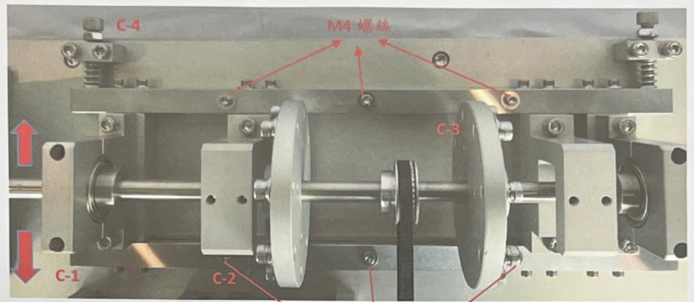

```text
1-2-3 Inertia Disc Module Description
[Figure 1-10 Inertia Disc Module Appearance]
- Labels C-1, C-2, C-3, C-4, M4 Screws

C-1 Inertia Disc Bearing Housing (2 sets)
    C-1-1 Bearing Inner Diameter (ID): 20mm
    C-1-2 Bearing Outer Diameter (OD): 37mm
    C-1-3 Bearing Thickness: 9mm
    [Translator's Note: The original text reads "後度" (rear-degree), which is a typo for "厚度" (thickness).]
C-2 Displacement Sensor Mounting Bracket (2 sets)
C-3 Inertia Disc (2 sets)
    C-3-1 Inertia Disc Weight: 202g
    C-3-2 Screw / Inertia Weight Bead: 7.1g
    C-3-3 Total Weight: 202 + (7.1 * 8) = 258.8g
C-4 Inertia Disc Module Adjustment Screws
    C-4-1 Adjustable offset between the inertia disc module and the motor shaft center.
    C-4-2 Displacement range: ±1.5mm
    C-4-3 When adjusting the offset, first loosen the 6 M4 screws on the module before proceeding.
    C-4-4 Turning the screw clockwise shifts the module upward on the drawing.
    C-4-5 Turning the screw clockwise shifts the module downward on the drawing.
    [Translator's Note: The original text lists "clockwise" (順時針) for both upward (C-4-4) and downward (C-4-5) offset adjustments. This is likely a typographical error in the source document.]
```

---

## Chapter 2: Control Box Operation

### Page 12 (MISSING)
> [!WARNING]
> The source image for Page 12 is missing. This page likely introduced "Chapter 2: Control Box Operation" and detailed the initial setup, power activation sequence, and control box interface layout.

---

### 3. Running the Inverter & 4. Frequency Adjustment (Page 13)
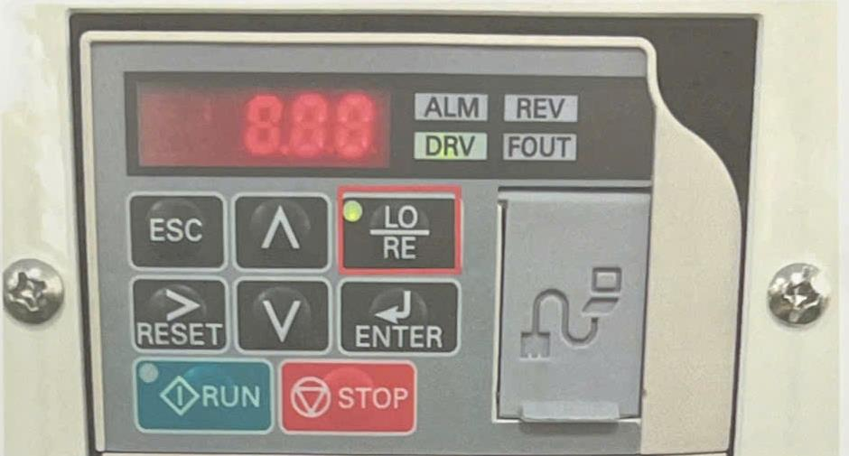
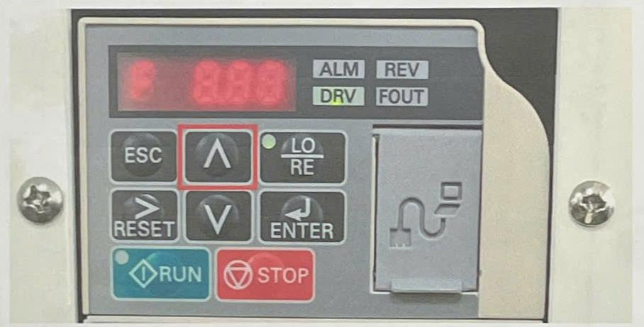

```text
3. Running the Inverter
   Press the "LO/RE" key; the indicator light will illuminate.
[Figure 2-3 Running the Inverter]

4. Press the UP arrow button to adjust and increase the induction motor frequency.
[Figure 2-4 Pressing the UP Arrow Button]
```

---

### 5. Adjusting Frequency to 20Hz & 6. Saving Settings (Page 14)
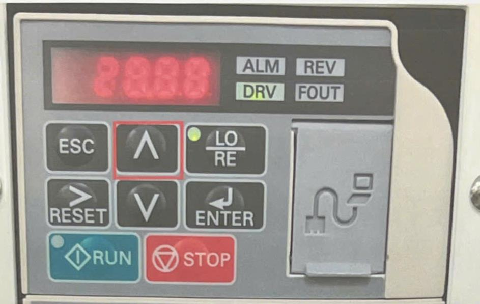
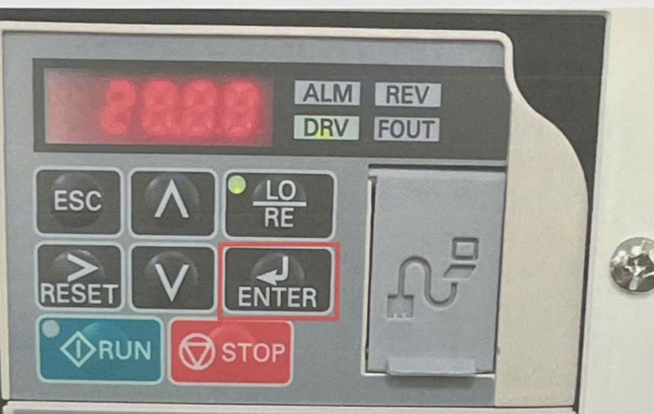

```text
5. Press the UP arrow button to adjust the induction motor frequency to 20Hz.
[Figure 2-5 Pressing the UP Arrow Button to 20Hz]

6. Press the "ENTER" key to set and save the frequency at 20Hz.
[Figure 2-6 Pressing ENTER]
```

---

### 7. Starting the Induction Motor & 8. Speedmeter Display (Page 15)
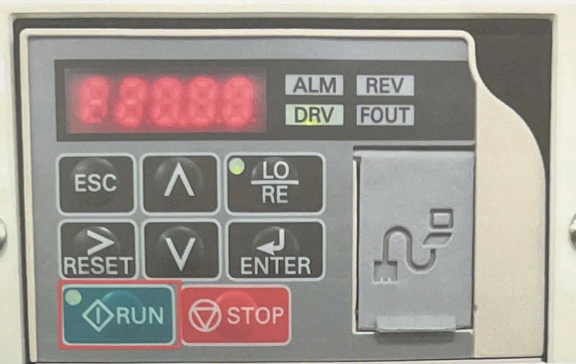
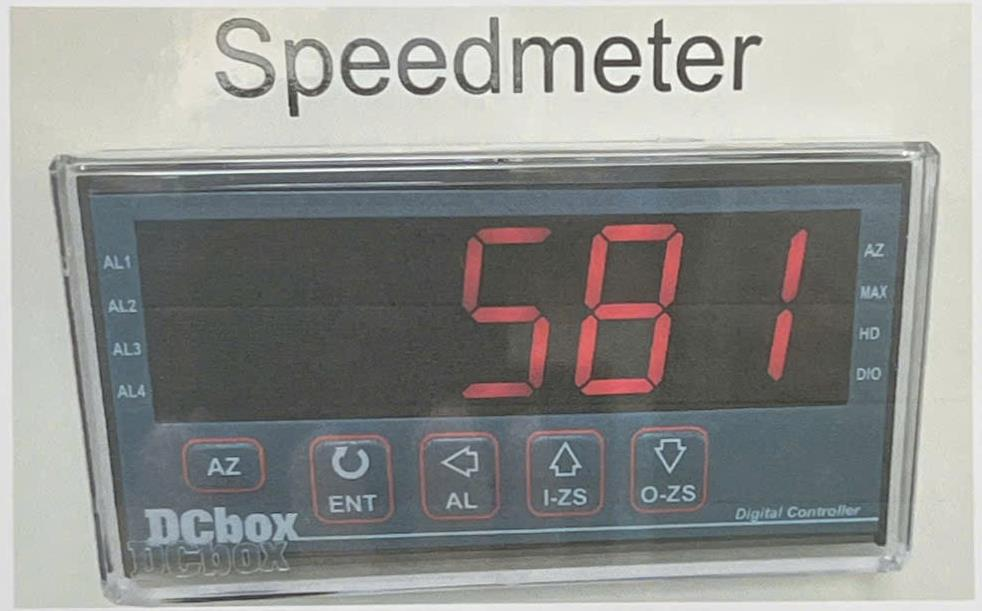

```text
7. Press the "RUN" button to start the induction motor; the indicator light will turn on.
[Figure 2-7 Pressing RUN]

8. The Speedmeter (Digital Controller) will display the motor's actual rotation speed (e.g., 581 rpm).
[Figure 2-8 Speedmeter Display]
```

---

### 9. Stopping the Induction Motor (Page 16)
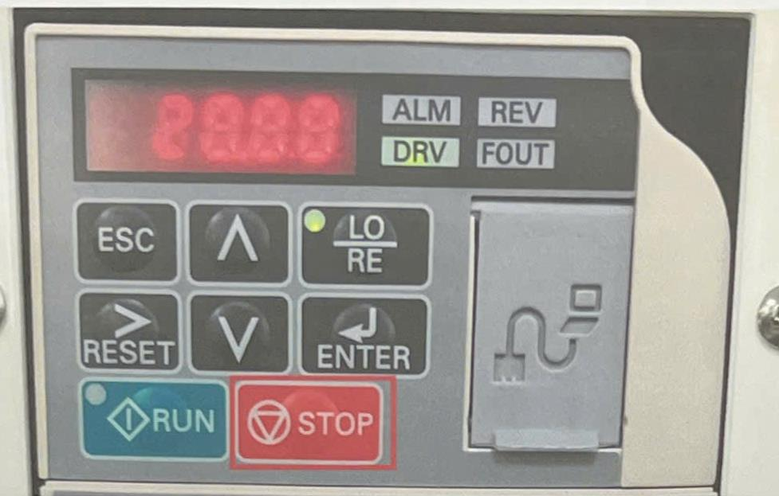

```text
9. Press the "STOP" button to stop the induction motor.
[Figure 2-9 Pressing STOP]
```

---

## Appendix: Manufacturer Delivery Slips

### Delivery Slip Page 1 (Transaction Details)

```text
Yuexu Co., Ltd.
TEL: (02) 8921-3505  FAX: (02) 8921-3540
No. 36, Yuxi St., Yonghe Dist., New Taipei City

Delivery Slip

Customer Name: Chang Gung University, Department of Mechanical Engineering
Contact Person: Shen Jiaxuan
Contact Phone: 03-2118800 Ext:
Contact Fax:

Delivery Date: 2019.05.31 (Minguo Year 108)
Quote/Invoice No: Y2019011801
Payment Terms: [Blank]
Delivery Lead Time: 60 working days
Delivery Address: No. 259, Wenhua 1st Rd., Guishan Dist., Taoyuan City
Unified Business No (Tax ID): [Blank]
Customer Signature: Shen Jiaxuan

Quoting/Issuing Entity: Yuexu Co., Ltd.
Representative: Zhang Yanxiang 0921193288
```

---

### Delivery Slip Page 2 (Equipment Specifications Table)

| No. | Model / Specifications Description | Qty | Unit Price | Amount |
|---|---|---|---|---|
| 1 | Diagnosis Platform | 1 | | |
| | **I. Prime Mover (Motor)** | | | |
| | 1. Induction motor power: 90W | | | |
| | 1.1 Speed: 1750rpm | | | |
| | 1.2 Motor mounting fixture | | | |
| | 1.3 Jaw-type flexible coupling | | | |
| | **II. Transmission Module** | | | |
| | 1. Prime mover gear transmission assembly | | | |
| | 1.1 Gear bearing housing | | | |
| | 1.2 Gear type: Spur gear; Material: S45C; Surface treatment: Electroless nickel plating | | | |
| | 1.2.1 Teeth: 25T; Gear module: 2 | | | |
| | 1.2.2 Pressure angle: 20 degrees | | | |
| | 1.2.3 Tip diameter (Outer diameter): 54mm | | | |
| | 2. Inertia disc gear transmission assembly | | | |
| | 2.1 Gear bearing housing | | | |
| | 2.2 Gear type: Spur gear; Material: S45C; Surface treatment: Electroless nickel plating | | | |
| | 2.2.1 Teeth: 50T; Gear module: 2 | | | |
| | 2.2.2 Pressure angle: 20 degrees | | | |
| | 2.2.3 Tip diameter (Outer diameter): 104mm | | | |
| | 3. Transmission gear ratio: 2:1 | | | |
| | 4. Accelerometer adapter shaft; Material: POM | | | |
| | **III. Inertia Disc Module** | | | |
| | 1. Inertia disc bearing housing | | | |
| | 2. Inertia disc shaft; Material: SUS303 | | | |
| | 3. Inertia disc; Material: AL6061-T6; Surface treatment: Clear/natural anodized | | | |
| | **IV. Control Box** | | | |
| | 1. Inverter | | | |
| | 1.1 Rated input: Single-phase 220V | | | |
| | 1.2 Rated output: Three-phase 200V~240V | | | |
| | 2. Digital Speedmeter Head | | | |
